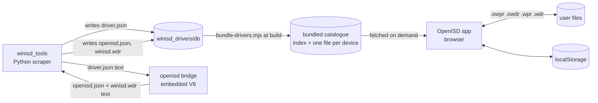
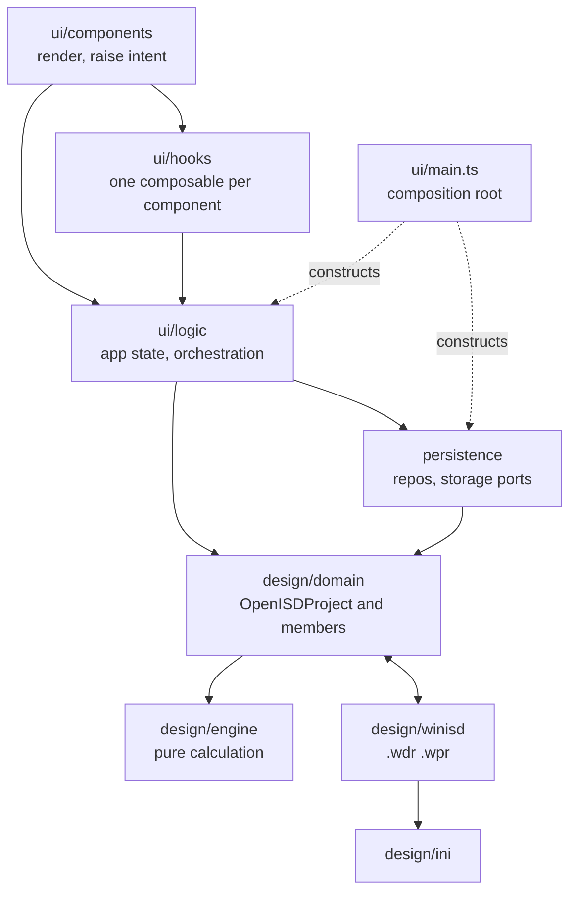
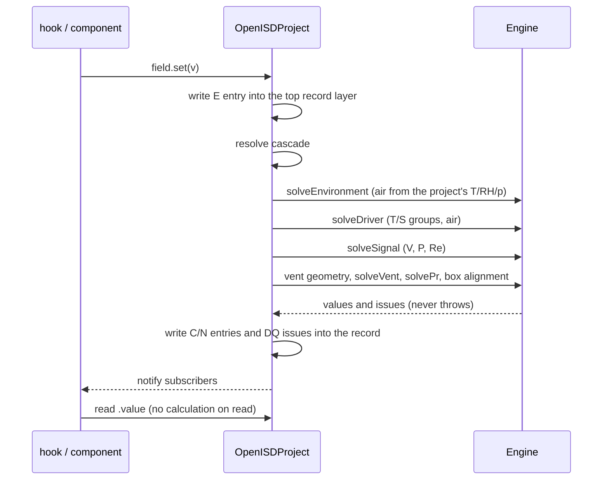

# OpenISD — architecture

OpenISD is a loudspeaker enclosure simulator that runs in the browser. It opens and writes
WinISD's files and reproduces WinISD's calculations. Where WinISD is wrong, OpenISD departs
from it on purpose.

Related: [RESEARCH.md](RESEARCH.md) (theory, and WinISD's measured behaviour) ·
[gap list](OPENISD_WINISD_GAPS_AND_BUGS.md) · [FEATURES.md](FEATURES.md) ·
[TESTING_STRATEGY.md](TESTING_STRATEGY.md) · [doc index](DOCUMENTATION.md).
Previous version: [docs/_archive/ARCHITECTURE_2026-09-24.md](docs/_archive/ARCHITECTURE_2026-09-24.md).

## 1. System context

The work spans three repositories:

- **`winisd_tools`** scrapes manufacturers' datasheets into driver records.
- **`winisd_drivers`** stores those records.
- **`openisd`** is this repository: the app, and the only code that turns a scraped record into
  an OpenISD record or a WinISD file.

- **One implementation of each transform.**
  - The bridge (`packages/design/winisd/bridge.ts`) is the headless domain built into one
    self-contained script.
  - `winisd_tools` loads it into an embedded V8 and calls it with text. It returns text and
    reads or writes no file itself.
  - This gives one reader and one writer for each format, rather than one per language.
- **No backend.** The physics, the files and the catalogue all run in the browser. Anything
  that would need a server (accounts, cloud storage, collaboration) is out of scope.
- **The catalogue is fixed at build time.** A driver added to `winisd_drivers` reaches users on
  the next deploy. At run time the app fetches one index per device kind when a picker opens,
  and one record when a device is chosen.
- **`winisd_drivers/db` is read-only to OpenISD.** Only `winisd_tools` writes it.

## 2. Packages and layers

| Package                 | Responsibility                                                      | Depends on                 |
|-------------------------|---------------------------------------------------------------------|----------------------------|
| `@openisd/design`       | The domain, the engine and WinISD file formats. No DOM, no browser. | `zod`, `yaml`              |
| `@openisd/persistence`  | Repositories over browser storage, files and the catalogue.         | `design`                   |
| `@openisd/ui`           | The Vue 3 app.                                                      | `design`, `persistence`    |

Inside the packages the main layers are below. The full matrix of legal import edges is
`ALLOWED_EDGES` in `packages/ui/test/ui/architecture.test.ts`; it also allows hooks, logic and
persistence to import engine types, and logic to import `design/winisd`.

| Layer            | Owns                                                                 | Must not                                                   |
|------------------|----------------------------------------------------------------------|------------------------------------------------------------|
| `ui/components`  | Markup and bindings.                                                 | Make decisions, or import a domain value.                  |
| `ui/hooks`       | The behaviour behind one component, as a composable tested without a DOM. | Hold module-level state.                              |
| `ui/logic`       | The open projects, presentation state, file I/O orchestration, driver browsing. | Calculate anything a domain object can answer.  |
| `persistence`    | Storage keys, payload upgrades, catalogue fetch and caching.         | Validate a record; the domain does that. It passes `.owpr`/`.owdr` text to and from the domain. `projectSchemaUpgrade.ts` knows retired payload shapes only. |
| `design/domain`  | The project aggregate, its fields, its solve cascade, file text.     | Do acoustics; that belongs to the engine.                  |
| `design/engine`  | Air, T/S solving, box design, the circuit, sweeps.                   | Throw, or know about files.                                |
| `design/winisd`  | `.wdr`/`.wpr` parsing and writing, ParState, WinISD text encoding.   | Model the physics.                                          |

Enforcement, as tests that fail the build:

- `packages/ui/test/ui/architecture.test.ts`:
  - a matrix of legal import edges; an edge not on it fails;
  - only the approved stores may hold state;
  - components import no domain values.
- `packages/design/test/architecture-*.test.ts`:
  - no casts, and no mutable module state;
  - no record types exported from the domain barrel;
  - no contradictory field interfaces;
  - the engine boundary.

## 3. Domain model

### The project aggregate

`OpenISDProject` is the single entry point to a design. Everything else is reached through it:

| Member                                      | What it is                                                                                    |
|---------------------------------------------|-----------------------------------------------------------------------------------------------|
| `driver`                                    | An embedded `OpenISDDriver`, a copy with no live link to the library entry it came from.       |
| `box.radiator`                              | An embedded passive radiator. Every project has one, blank until one is chosen.               |
| `box`                                       | Every box type's section at once: sealed, vented, bandpass 4 and 6, ABC, passive radiator.    |
| vents                                       | Seven vent slots across the box types, each with shape, count, dimensions and tuning.          |
| `signal`                                    | Drive voltage and input power.                                                                |
| `driverEmbedding`                           | Driver count, wiring, series resistance, voice-coil temperature rise.                         |
| environment                                 | Temperature, humidity, pressure, and the choice of air model.                                  |
| filters, charts, metadata                   | The filter chain, open charts and loss model, and name and description.                        |

- **Switching box type deletes nothing.** The other sections go dormant. Only the `.wpr` writer
  leaves them out, because WinISD's format cannot hold them.
- **Drivers and radiators are components**, with catalogue identity, provenance and a library.
- **Vents and box types are configuration.** They are sized by the designer and have no
  catalogue.
- **Driver and radiator records are separate types.** A driver cannot be placed in the
  radiator slot, nor a radiator in the driver slot. Loading either fails at parse, with a named
  problem.

### Fields

Every value is a field built from small capability interfaces (`domain/cell.ts`):

| Capability       | Meaning                                                      |
|------------------|--------------------------------------------------------------|
| `Readable<V>`    | `.value`                                                     |
| `Entered`        | `.entered`: a person stated it                               |
| `Calculated`     | `.calculated`: the solve produced it                         |
| `Writable<T>`    | `.set(v)` records an entered value                           |
| `Clearable`      | `.clear()` withdraws an entered value                        |
| `Calculatable<T>`| `setCalculated(v, dq)`, `setDq(dq)`: the solver writes C or a DQ issue |
| `Unsolvable`     | `setNotAvailable()`: the solver writes N                     |
| `Precise`        | `.precision`                                                 |

- **The declared type states what the field can do.** A field's type is the intersection of the
  capabilities it has; there is no god class. For example, drive voltage is
  `Readable<number> & Entered & Calculated & Writable & Clearable & Calculatable`.
- **Provenance** follows WinISD's ParState:
  - **E** entered;
  - **C** calculated;
  - **N** not available.
- **The state of a stored value is part of the record.** A value is held as `{state, value}`,
  with DQ lists split by producer (`dq_scraper`, `dq_calculated`). N is the absence of an
  entry. The state is not worked out afresh on each read.
- **Defaulting fields are never null.** The three environment conditions, vent count, the
  voice-coil count and wiring, the driver's `c`/`roo` and the drive voltage read their default as
  C until someone enters a value. `clear()` returns them to C.
- **Absence is `null`**, spelled one way. There are no sentinel objects.

## 4. Solving

- **Reads never calculate.** A read returns what the last solve stored. The solve runs on every
  write and on load, in a fixed order: environment, driver, signal, vents, box.
- **The engine is pure:**
  - it takes numbers and returns values and issues;
  - failure is a value (`{values, issues}`), never an exception;
  - the domain turns issues into DQ marks on fields.
- **Relation groups solve in every direction.** Any two of Qts/Qes/Qms give the third;
  Fs/Mms/Cms/Vas close on each other; tuning and vent length solve each other.
- **Entered values are never overwritten.**
  - When entered values disagree, every member of the group carries an `inconsistent-inputs`
    DQ issue, and the user decides.
  - WinISD drops the losing value without notice; OpenISD does not.
- **The split between domain and engine: geometry is in the domain, acoustics are not.**
  - The domain may compute pure geometry, such as a vent's area from its dimensions.
  - Anything involving air, compliance or frequency is the engine's.
  - Rule of thumb: if two implementers could disagree on the model, it belongs in the engine.
- **The sweep** is `Engine.sweep(driver, Le, boxType, params)`. The UI re-runs it on every
  change, throttled to about 30 per second, and holds the last result in `appState`. The UI
  maps its arrays onto chart series and does only axis ranges and unit scaling.

## 5. State

### Inside a project

`OpenISDProject` holds three record layers (`#saved`, `#edited`, `#whatif`) and the engine. Its
other private fields (identity, listeners, a derived issue cache, the chart cursor) never enter a
record. `architecture-project-has-three-fields.test.ts` pins the allowed set.

| Record layer | Holds                                         | Ends by                           |
|--------------|-----------------------------------------------|-----------------------------------|
| `#saved`     | The project as of the last save.              | `save()` replaces it.             |
| `#edited`    | Every change since the last save, or `null`.  | `save()` promotes it.             |
| `#whatif`    | A tuning session (the Tune panel).            | `cancelWhatIf()`, always discarded. |

- **Writes land in the top record layer.** Reads come from `#whatif ?? #edited ?? #saved`.
- **A what-if never commits.** It explores values that may not match any real part. Making a
  change permanent is the editor's job.
- **The project is observable.** It publishes `subscribe(fn)`, and has no dependency on Vue.
  `ui/logic/liveProject.ts` turns each notification into a Vue invalidation.

### In the app

Only these modules may hold state, and the architecture test enforces it:

| Store                  | Holds                                                                            |
|------------------------|----------------------------------------------------------------------------------|
| `logic/appState.ts`    | The open projects in order, the focused project, the engine, app settings.       |
| `logic/presentationState.ts` | Open dialogs, chart zoom, unit choices, chart colours.                     |
| `logic/urlAppState.ts` | Writes the share URL to the address bar; holds nothing. `persistence/projectRepo` builds and reads it. |

### What persists

| What                                   | Where                                           | Written by                   |
|----------------------------------------|-------------------------------------------------|------------------------------|
| Open projects (autosave)               | localStorage, as `.owpr` text                   | `persistence/projectRepo`    |
| A project file                         | `.owpr` on disk (File System Access API)        | `projectRepo` + `fileStorage`|
| Share link                             | URL hash: the project text plus view state      | `projectRepo`                |
| My Drivers, My Passive Radiators       | localStorage, as `.owdr` text                   | `myDriverRepo`, `myPassiveRadiatorRepo` |
| Options (air defaults, vented limits)  | localStorage                                    | `appSettingsRepo`            |
| Favourites, layout, view state         | localStorage                                    | `prefsRepo`, `viewStateRepo` |
| A record refused at load               | localStorage, under its own quarantine key      | `projectRepo` (see Startup)  |

- **The domain serialises itself.**
  - Record JSON exists only inside `@openisd/design`.
  - Everything outside it handles domain objects or opaque text.
  - Storage keys are listed in one file, `persistence/repos/storageKeys.ts`.
- **What-ifs and open dialog drafts are never persisted.** An uncommitted value must not come
  back after a refresh looking like a decision.
- **Every boundary validates.**
  - A zod parse at the load boundary returns problems, never an exception.
  - One bad record costs that record, not the session.

### Startup

`ui/logic/boot.ts` holds the order the application restores itself in. A phase runs only once
the phase before it has returned, and it is the only place that order is stated.

| # | Phase          | Does                                                                     |
|---|----------------|--------------------------------------------------------------------------|
| 1 | Share link     | A URL hash carries the whole session; when there is one it replaces every other restore and the sequence ends. |
| 2 | Session        | Every project open at the last refresh.                                  |
| 3 | Legacy project | The single stored project older sessions saved, when phase 2 found none. |
| 4 | View           | Unit choices, chart colours, which panels were open.                     |
| 5 | Panels         | Reopens those panels — and does nothing without a focused project.       |

- **Persistence is armed after the sequence resolves, never during it.** Nothing writes a
  storage key while the boot is still reading it.
- **A panel is restored by the sequence, not by a watcher.** A component may RECORD that it is
  open; reopening it is phase 5's job, because only the sequence knows a project exists by then.
- **A stored view outlives the project it describes.** Every phase-5 restore is conditional on
  the project phases having produced one.
- **A record that cannot be read is copied to a quarantine key before persistence is armed.**
  The live key is then usable again, so a bad record costs one load rather than every future
  one, and its bytes stay recoverable.

## 6. Files and formats

| Format    | Kind                                      | Read                     | Write                 |
|-----------|-------------------------------------------|--------------------------|-----------------------|
| `.owpr`   | OpenISD project (JSON)                    | yes                      | yes                   |
| `.owdr`   | OpenISD driver or radiator (JSON)         | yes                      | yes                   |
| `.wpr`    | WinISD project (INI)                      | yes                      | yes, with losses      |
| `.wdr`    | WinISD driver (INI + ParState)            | yes                      | yes                   |
| `openisd.json` | Catalogue record from `winisd_drivers` | yes (bundled)           | bridge only           |

- **OpenISD's model is a superset of WinISD's.**
  - Every `.wdr` key has a place in the model (`wdr-model-coverage.test.ts`); `.wpr` sections
    are covered by `winisdProject.test.ts`.
  - Import never silently drops a key.
  - Export trims to what WinISD can express, and reports what it left out.
- **WinISD files are Windows INI.** `design/ini` is the only INI parser.
  - `design/winisd` owns ParState and WinISD's text encoding.
  - WinISD writes UTF-8 and stores a newline as the byte `A4`, so its reader destroys any
    character whose UTF-8 contains `A4`.
- **File I/O belongs to the domain object it reads or writes.** For example,
  `project.toWprText()` and `OpenISDProject.fromOwprText()`. `ui/logic/useApplicationIO.ts`
  only chooses file names, calls those methods and shows messages.

## 7. Patterns and coupling rules

- **One composition root.** `ui/main.ts` is the only place that constructs services:
  - it builds each repository with its collaborators passed in;
  - it hands one facade (`logic/app.ts`) to the component tree through `provide`/`inject`;
  - nothing below it reaches for a ready-made instance, so every part can run in a test with
    substitutes.
- **Dependencies are injected.** A service exports a `create*()` factory, never an instance.
  - Real I/O sits behind narrow ports: `KeyValueStorage`, `FileStorage`, `fetch`.
- **No mutable module state.** No `let` at module scope, no unfrozen containers, no registries.
  - The three approved stores (§5) are the only holders of app state.
  - `hooks/useEscToClose.ts` keeps a module-level dialog stack that the test does not catch.
- **Components decide nothing.** A component with behaviour has an `X-hooks.ts` composable
  holding it (13 of 23 components today):
  - this keeps most UI coverage in fast node tests;
  - it keeps the markup a thin binding.
- **Types carry the facts:**
  - closed sets are sum types or Java-style enum classes, such as `LossMode` and `DriverType`;
  - matches over them are exhaustive;
  - semantic primitives are branded;
  - there are no casts and no `any` in `design` (tested); `ui` has two DOM-event casts;
  - external data is parsed at the boundary.
- **One name per field.** Each external vocabulary is mapped once, at its own boundary.
  Examples are a datasheet's `Resonance frequency` and WinISD's `Bl`.
- **One owner per fact.** Two stores holding the same fact is a bug. Delete one of them rather
  than keeping the two in step.

## 8. Testing

The full strategy is in [TESTING_STRATEGY.md](TESTING_STRATEGY.md).

| Tier | What                                          | Runner            | Where                                     |
|------|-----------------------------------------------|-------------------|-------------------------------------------|
| 1    | Engine, domain, formats, persistence           | Vitest (node)     | `packages/design`, `packages/persistence` |
| 2    | Hooks and components, with hooks mocked        | Vitest (node)     | `packages/ui/test/**/*.test.ts`           |
| 3    | End-to-end journeys in a real browser          | Playwright        | `packages/ui/test/**/*.browser.spec.ts`   |

- **Test-driven development is mandatory.** Write the failing test at the cheapest tier that
  shows the behaviour, then the code.
- **A skip is a failure.** A reporter turns skips into failures. Tests are never deleted or
  weakened to get a green run.
- **Engine and domain are at 100% coverage from their own unit tests alone.** There is a
  per-file threshold and no `v8 ignore`. Run `npm run coverage:design`.
- **Architecture is tested.** The layer matrix, store ownership, the cast ban and the global
  ban all fail the build (§2).
- **Fixtures are generated, never hand-written.**
  - Project fixtures come from the real builder or wizard, so they cannot drift from the app.
  - Parity scenarios name explicit values, never a catalogue driver.
- **Two kinds of golden:**
  - **OpenISD's own:** `engine/golden.test.ts` pins sweep output exactly, and guards against
    regressions.
  - **WinISD's:** `.wpr` files that WinISD itself saved, from explicit scenarios.
    `winisd-parity-functional.test.ts` diffs OpenISD against them field by field.
  - WinISD cannot export curves, so the WinISD goldens cover field calculations only.
  - How they are generated is described in [RESEARCH.md](RESEARCH.md#golden-files-from-winisd).
- **Probing both apps.**
  - For a chart-level question, one case goes into real WinISD (under wine) and into
    `Engine.sweep` with the same inputs.
  - WinISD's curves are traced from its plot pixels.
  - Example: [`docs/research/PROBE_W5_SEALED_20260924.md`](docs/research/PROBE_W5_SEALED_20260924.md).
- **Gates:**
  - pre-commit runs lint, typecheck and unit tests;
  - pre-push adds the browser suite;
  - CI runs lint, typecheck, unit, Playwright, then build.

## 9. Deliberate departures from WinISD

| Topic                         | WinISD                                                                                      | OpenISD                                                                                                                | Why |
|-------------------------------|---------------------------------------------------------------------------------------------|------------------------------------------------------------------------------------------------------------------------|-----|
| Where air comes from          | App-level Options only, read once per launch. A project's own T/RH/p are ignored.           | Each project has its own air. Unentered conditions are C, from Options, and follow later Options changes. Entered ones stay. Unentered driver `c`/`roo` follow the project's air on every solve; entered ones stay. | Two projects with the same inputs must simulate the same. An Options change must not leave open projects stale. |
| Air formula                   | DPC's constants: Hyland–Wexler vapour pressure, `ρ = γp/c²`.                                | Both formulas available. `useWinisdAirModel` (on by default) reproduces WinISD's; off gives CIPM-2007.                  | Matching WinISD by default, with a physical model available. |
| Contradictory inputs          | The losing route is dropped without notice; disagreeing entered values are never compared.  | Every member of an inconsistent group is marked with a DQ issue. Entered values are never changed.                      | The disagreement is information. |
| Voice-coil wiring             | A wiring change rewrites `Re` and `BL` and leaves them marked Entered.                      | Per-coil `Re`/`BL` stay as entered. Terminal `Re`/`BL` are separate calculated fields.                                  | A typed value must not change under the user. |
| Derived fields on load        | Figure-of-merit fields (EBP, Rme, γ, Mpow, SPLmax, SPLmaxLF, Gloss) read `0` until any field is edited. | Solved on load.                                                                                                        | A `0` meaning "not computed" cannot be told apart from a real zero. |
| Sealed-box loss model         | One model: the lossy cubic.                                                                 | Three to choose from: WinISD's lossy cubic (default), conventional, lossless.                                           | Comparison with textbook results. |
| Voice-coil inductance         | One switch: Le in both SPL and impedance, or in neither.                                    | `circuitModel`: `winisd` or `gyrator`. Currently inconsistent; see the gap list.                                         | Open. |
| Tuning (what-if)              | Not present.                                                                                | The Tune panel explores changes on the whole project, and always discards them.                                          | Explore without corrupting real driver data. |
| Drive voltage / power         | A three-way cascade of power, voltage and resistance.                                       | Voltage is never empty. Power is C from V²/Re, or N when Re is missing. Whichever was entered last wins.               | Charts always have a drive level. |

## 10. Feature comparison with WinISD 0.7

WinISD's side comes from its screenshots, its help files and the probes in `winisd_research`. For calculation differences and bugs, see the [gap list](OPENISD_WINISD_GAPS_AND_BUGS.md).

### Box types

| Box type                     | WinISD | OpenISD                                     |
|------------------------------|--------|---------------------------------------------|
| Sealed                       | yes    | yes                                         |
| Vented                       | yes    | yes                                         |
| 4th-order bandpass           | yes    | yes                                         |
| Passive radiator             | yes    | yes                                         |
| 6th-order bandpass           | yes    | stored, not simulated                       |
| ABC (aperiodic bi-chamber)   | yes    | stored, not simulated                       |
| Isobaric loading             | yes    | stored, not simulated                       |

### Charts

| Chart                                    | WinISD | OpenISD |
|------------------------------------------|--------|---------|
| SPL                                      | yes    | yes     |
| Transfer function magnitude and phase    | yes    | yes     |
| Group delay                              | yes    | yes     |
| Cone excursion (driver and radiator)     | yes    | yes     |
| Impedance magnitude and phase            | yes    | yes     |
| Port air velocity                        | yes    | yes     |
| Maximum SPL, maximum power               | yes    | yes     |
| Filter magnitude, phase and group delay  | yes    | yes     |
| Amplifier apparent load power (VA)       | yes    | no      |
| Port gain                                | yes    | no      |
| Intrachamber port velocity               | yes    | no (needs ABC) |
| Radiator transfer function and phase     | yes    | no      |
| Overlay of several projects              | yes    | yes     |

### Signal, filters and environment

| Feature                                          | WinISD | OpenISD |
|--------------------------------------------------|--------|---------|
| Input power, drive voltage, series resistance    | yes    | yes     |
| Listening distance, off-axis angle               | yes    | no (fixed 1 m, on axis) |
| High-pass, low-pass, Linkwitz transform, parametric EQ | yes | yes |
| Low shelf, high shelf                            | no     | yes     |
| All-pass, DLP raised-cosine, static gain         | yes    | no      |
| Temperature, humidity, pressure drive the air    | Options only | per project |
| Transmission-line port model                     | yes    | yes     |
| Force flat response                              | yes    | yes     |
| Rg at driver side                                | yes    | yes     |
| Xmax-limited SPL                                 | yes    | yes     |
| Voice-coil temperature rise                      | yes    | yes     |
| Added mass on the driver cone and the radiator   | yes    | yes     |
| Vent count, slotted vents                        | yes    | yes     |
| Signal generator (audible tone)                  | yes    | yes     |

### Design tools and data

| Feature                                              | WinISD | OpenISD |
|------------------------------------------------------|--------|---------|
| Sealed alignment picker (WinISD's nine Qtc targets)  | yes    | yes     |
| Vented alignments QB3, BB4, EBS3, EBS6, C4           | yes    | yes     |
| Vent length from tuning, and tuning from length      | yes    | yes     |
| Radiator added mass for a target tuning              | not verified | yes |
| Driver library                                       | local `.wdr` files | 1,603 drivers and 79 radiators bundled, plus My Drivers |
| Data-quality marks on inconsistent or missing inputs | no     | yes     |
| Equation inspector (the formula behind a value)      | no     | yes     |
| What-if tuning panel                                 | no     | yes     |

### Platform and files

| Feature                                  | WinISD          | OpenISD                          |
|------------------------------------------|-----------------|----------------------------------|
| Runs on                                  | Windows         | any modern browser; optional Electron build |
| Works offline                            | yes             | yes (installable PWA)            |
| `.wdr` / `.wpr` read and write           | yes             | yes                              |
| Native JSON project and driver files     | no              | `.owpr`, `.owdr`                 |
| Share a design as a link                 | no              | yes                              |
| Several projects open, autosaved         | several open    | yes, autosaved to the browser    |
| Curve data export                        | no              | no                               |
| Source                                   | closed          | open                             |

## 11. Delivery

- **Build:** Vite. `npm run build` produces the web app.
- **Offline:** a Workbox service worker caches the app and the catalogue.
- **Desktop:** `make electron` builds the same UI as an Electron app.
- **Hosting:** the web build is published to GitHub Pages.
- **Bridge:** `npm run build:bridge` builds `packages/design/dist/openisd-bridge.js` for `winisd_tools`.

## 12. Transparency and learning

WinISD tells you a number. OpenISD tells you where it came from — that's a design goal, not a
side effect of the field model in §3.

- **The equation inspector shows how a field relates to others.** Click a value, see the
  formula that can derive it and the fields that feed it
  (`packages/ui/src/logic/provenance.ts`, `EquationInspectorModal.vue`). It answers "what does
  this depend on and what depends on it", not just "what is this number".
- **DQ issues explain a dependency, not just flag a problem.** A DQ mark names which fields
  disagree or which one is missing (§4), so the message itself teaches the relationship instead
  of just failing silently the way WinISD does.
- **Terminology is kept to a minimum.** One name per external vocabulary, mapped once at its
  boundary (§7). Fewer names to learn means the provenance graph and the DQ messages stay
  readable instead of turning into a glossary lookup.
- **Tooltips are short facts, not restated labels.** A tooltip earns its place by adding
  something the label doesn't already say — what the field measures, its formula, or a
  consequence of changing it (`packages/ui/src/logic/fields/uiFields.ts`).
