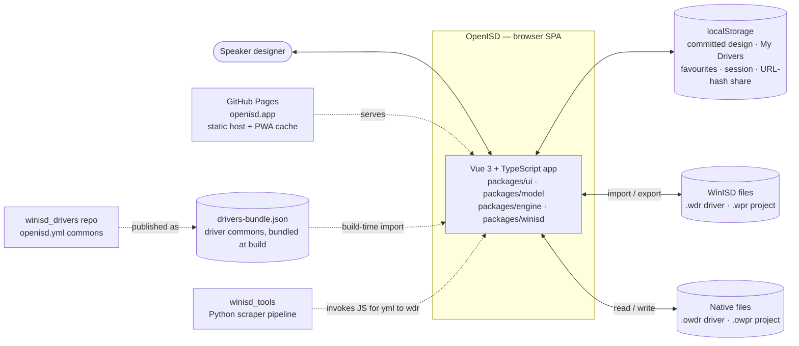
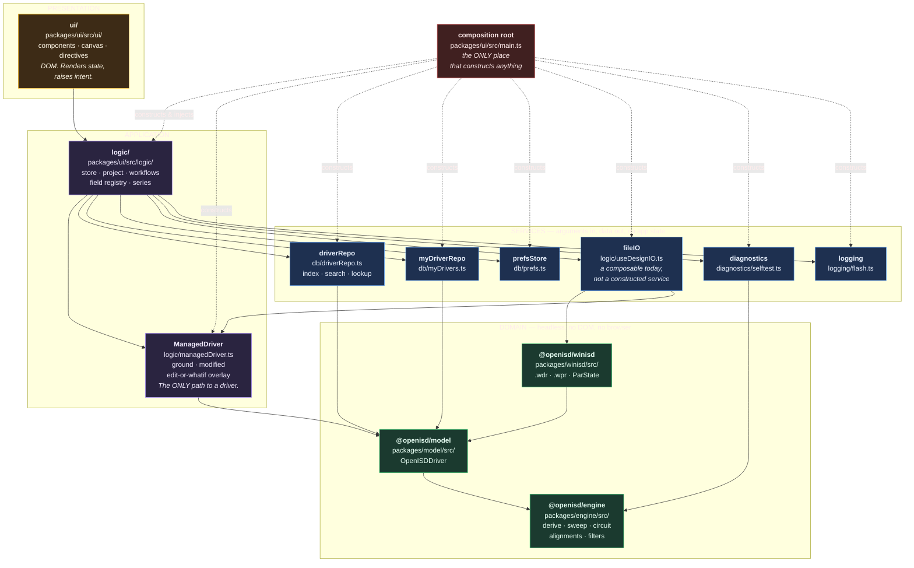
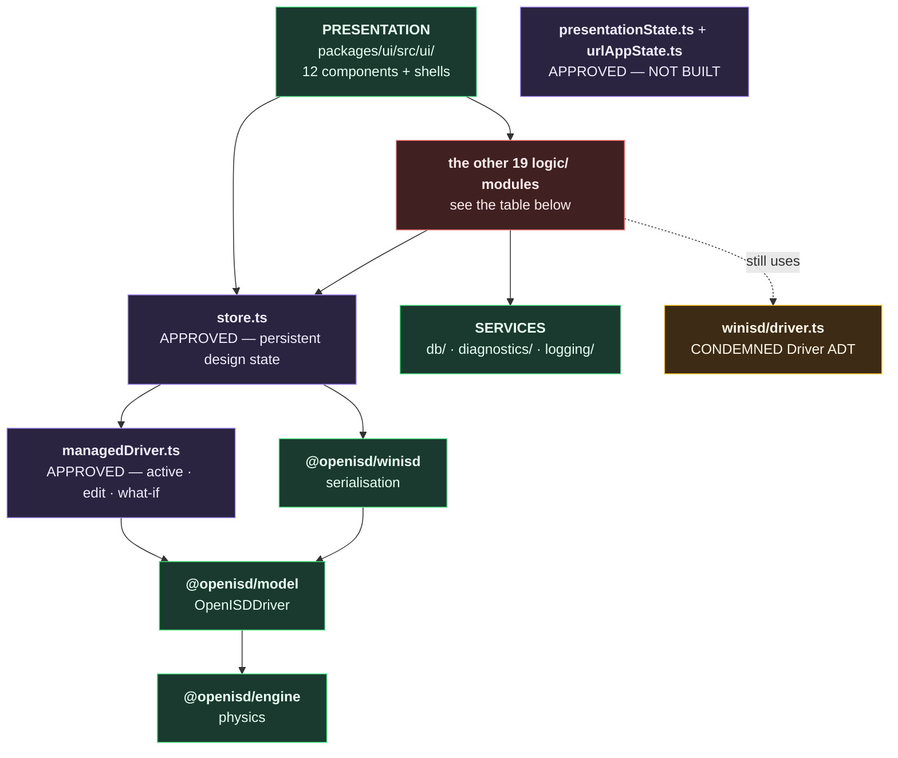
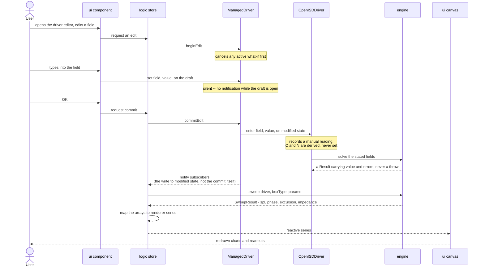

# OpenISD — architecture specification

**This document specifies the system.** It defines the boundaries, the layers, the dependency
direction, the driver model, the runtime data flow and the invariants that hold across the whole
application.

## The standing of this document

**This document is the authority.** Where any other document, plan, rule file, comment, test name
or code comment disagrees with it, **this document is correct and the other is wrong**.

**A conflicting document is a cleanup item, never a blocker.** Raise it as a TODO in
[`docs/plans/OPENISD_TARGET_MIGRATION_PLAN.md`](docs/plans/OPENISD_TARGET_MIGRATION_PLAN.md) and
carry on. Nobody stops work to reconcile a stale document, and nobody weakens this specification to
match one.

**Code that does not match this specification is unfinished work.** It is tracked in the migration
plan and it is not an argument about what the system is. The specification states the system; the
code catches up to it.

## What this document does not specify

Each row below has an owner, and that owner is the authority for the detail. This document states
the boundary and points at it.

| Detail                                                                              | Authority                                                              |
| ----------------------------------------------------------------------------------- | ---------------------------------------------------------------------- |
| Engine formulas, parameter units, API shapes, solver rules                          | [`docs/spec/SPEC_ENGINE.md`](docs/spec/SPEC_ENGINE.md)                 |
| UI presentation rules, tooltips, panel layout, control conventions, chart behaviour | [`docs/spec/SPEC_UI.md`](docs/spec/SPEC_UI.md)                         |
| What the app remembers, and when an edit commits                                    | [`docs/design/STATE_MODEL.md`](docs/design/STATE_MODEL.md)             |
| WinISD's `.wdr`/`.wpr` byte format, reverse-engineered                              | [`docs/design/WDR_SCHEMA.md`](docs/design/WDR_SCHEMA.md)               |
| Work items and gaps                                                                 | [`BACKLOG.md`](BACKLOG.md), [`docs/plans/`](docs/plans/)               |
| Dev workflow, ports, testing strategy                                               | [`AGENTS.md`](AGENTS.md), [`openspec/project.md`](openspec/project.md) |

---

## 1. System context

OpenISD is a single-page browser application with no backend. Everything inside the boundary runs
in the user's browser; everything outside it is a file, a repository, or a static host.



### The no-backend boundary

**The simulator runs entirely in the browser.** No server, no account and no API call is required
for the physics, for file operations, or for reading the driver commons. The Thiele/Small model is
pure mathematics and needs no server; a backend costs money to run, adds availability risk, and
creates pressure toward paywalling a tool whose purpose is to be unconditionally free.

**A backend implies an authentication stack.** The moment a backend exists, authn/authz is
required, which means an identity provider and session management. **A feature that requires a
backend — accounts, cloud storage, collaborative editing — is out of scope.** A cloud feature that
is desirable anyway (Google Drive, for example) is strictly opt-in and degrades gracefully to the
no-cloud path.

### The driver commons is a build-time artifact

`drivers-bundle.json` is compiled from the `winisd_drivers` repository's `openisd.yml` records and
imported at build time. It is not a live API. A driver added to the commons reaches users on the
next deploy.

### `openisd.yml` is read and written exclusively by JS/TS owned by OpenISD

There is one implementation of each transform, not one per language. When the Python pipeline in
`winisd_tools` needs an `openisd.yml` from a `driver.yml`, or a `.wdr` from an `openisd.yml`, it
invokes the OpenISD JS/TS with input and output paths.

**The call is in-process, into an embedded V8** — not a subprocess and not an RPC. The contract
across that boundary is **string in, string out, and it never throws**: invalid input and
well-formed-but-wrong input both come back as `Result{value: null, errors}`, because a thrown value
cannot usefully cross an embedded-V8 boundary. The projection algorithm itself is
[`docs/spec/SPEC_ENGINE.md`](docs/spec/SPEC_ENGINE.md) §4.7.

---

## 2. Layers and components

**Four layers. Every import points DOWNWARD, one layer at a time.** No upward import, no lateral
import between siblings, and no skipping a layer — the UI does not reach past `logic` into a
service, and a service does not reach back into the app's state.

Each box is ONE responsibility. A module that both fetches data and drives the UI has two, and
belongs in two places.



**Solid arrow = "is given, and calls". Dotted = "constructs".** Only the composition root
constructs. Every other arrow is a collaborator that arrived as an argument, so the thing at the
tail can be exercised in a test with a substitute at the head.

**The diagram above is the TARGET.** It shows what the system is specified to be. The one below
shows what it IS.

### AS-BUILT — every module that exists today

This is the same system as the diagram above, drawn from what is actually on disk rather than from
what was specified. It exists because the target diagram is a poor guide to the current tree: it
omits modules that exist, and shows components (`PresentationState`, `UrlAppState`, `createFileIO`)
that have not been built. **A red box is a module the target diagram does not account for.** Every
red box is either work still to be placed, or a module that should not exist — none of them is
sanctioned by the target above.

**Kept small on purpose.** A diagram with forty boxes cannot be read at the size a Markdown
viewer renders it, and it cannot be enlarged. So the picture below shows only the SHAPE — the four
layers, the three approved state stores, and the direction of dependency — and the full module
inventory is the TABLE underneath, which is text and always readable.



#### The module inventory

**APPROVED** — the only modules permitted to hold state.

| Module                        | Status                                    |
| ----------------------------- | ----------------------------------------- |
| `logic/store.ts`              | built — persistent design state           |
| `logic/managedDriver.ts`      | built — active · edit · what-if           |
| `logic/presentationState.ts`  | NOT BUILT                                 |
| `logic/urlAppState.ts`        | NOT BUILT                                 |

**UNPLACED** — exists, but the target diagram collapses it into one `logic/` box, so that diagram
cannot say whether it belongs where it is, or at all.

| Module                          | What it does                                    |
| ------------------------------- | ----------------------------------------------- |
| `logic/useDesignIO.ts`          | open · save · export · share                    |
| `logic/driverSelection.ts`      | the driver-picker / editor workflow             |
| `logic/driverLibrary.ts`        | library browsing                                |
| `logic/persist.ts`              | localStorage + share-link encode/decode         |
| `logic/projectFile.ts`          | project file naming                             |
| `logic/model/OpenISDProject.ts` | project model                                   |
| `logic/model/workspace.ts`      | workspace model                                 |
| `logic/useVentGroup.ts`         | vent-group solving                              |
| `logic/usePrGroup.ts`           | passive-radiator group solving                  |
| `logic/useDriverCells.ts`       | E/C/N presentation + the Q-group rule           |
| `logic/series.ts`               | chart-series mapping                            |
| `logic/fields/`                 | units · field registry                          |
| `logic/provenance.ts`           | provenance presentation                         |
| `logic/environment.ts`          | air constants for the view                      |
| `logic/prWinIsdFields.ts`       | PR field conversions for the view               |
| `logic/wprMapping.ts`           | `.wpr` input assembly                           |
| `logic/fileSave.ts`             | File System Access wrapper                      |
| `logic/app.ts`                  | app facade (provide/inject)                     |
| `logic/toneGenerator.ts`        | tone generator                                  |
| `logic/useEscToClose.ts`        | Escape-key handling                             |
| `db/kv.ts`, `db/prLibrary.ts`   | key-value store · PR library                    |

**SERVICES / DOMAIN** — placed, and matching the target.

| Module                                                        | Layer   |
| ------------------------------------------------------------- | ------- |
| `db/driverRepo.ts` · `db/myDrivers.ts` · `db/prefs.ts`        | service |
| `diagnostics/selftest.ts` · `logging/flash.ts`                | service |
| `@openisd/model` · `@openisd/engine` · `@openisd/winisd`      | domain  |

**CONDEMNED** — scheduled for deletion, still imported.

| Module                    | Replaced by                                  |
| ------------------------- | -------------------------------------------- |
| `packages/winisd/src/driver.ts` (`Driver` ADT) | `OpenISDDriver` behind `ManagedDriver` |

**What the red tells you.** Twenty-two `logic/` and service modules exist that the target diagram
collapses into one `logic/` box, so it cannot say whether any of them is in the right place or
should exist at all. `useDesignIO.ts` is the sharpest case: the target names a `createFileIO`
SERVICE, but what exists is a `logic/` composable — the target's own module table marks it "not yet
built" and the as-built shows what stands in for it. `winisd/driver.ts` is amber: condemned,
scheduled for deletion, still imported.

### Modules, purpose, and injected dependencies

**No module-level singletons, and no exported mutable bindings.** Each module exports a
`create<Name>(deps)` factory and nothing pre-built: a ready-made instance cannot be substituted, so
every consumer of one becomes untestable in isolation. `state` is created by the store factory and
handed to whoever needs it — it is not importable.

| Module                       | Single responsibility                                                          | Injected dependencies                                           |
| ---------------------------- | ------------------------------------------------------------------------------ | --------------------------------------------------------------- |
| `main.ts` — composition root | Construct every service, the store and `ManagedDriver`, wire them, mount the app | — (it is the top; nothing injects into it)                      |
| `createStore`                | Hold the application's state — a `ManagedDriver` for the driver, everything else in `logic` | `driverRepo`, `myDriverRepo`, `prefsStore`, `fileIO`, `logging`, `ManagedDriver` |
| `ManagedDriver`              | The one facade over a driver's ground/modified/overlay state — see §3          | an `OpenISDDriver` factory                                      |
| `logic/` workflows           | Decide what the app does next — driver chosen, project opened, what-if applied | the store (and, through it, `ManagedDriver`), plus whichever services that workflow needs |
| `createDriverRepo`           | Answer questions about the driver commons: index, search, filter, lookup       | a bundle source (`() => OpenISDDriver[]`)                       |
| `createMyDriverRepo`         | Read, write and delete user-saved drivers by identity                          | a `KeyValueStore`                                               |
| `createPrefsStore`           | Browser-local preferences: favourites, session, layout                         | a `KeyValueStore`                                               |
| `createFileIO` — not yet built | Open, save, import, export, share-link encode and decode                     | the serialiser (`@openisd/winisd`), the record codec            |
| `createDiagnostics`          | Run the self-test and report what it found                                     | the engine, a reporter (`(msg) => void`)                        |
| `createLogging`              | Surface application events to the user                                         | — (leaf; it depends on nothing)                                 |
| `ui/`                        | Render state, raise intent                                                     | the app facade, via Vue `provide`/`inject` at the root          |

A `KeyValueStore` is an interface — `get`/`set`/`remove`. `localStorage` is one implementation and
an in-memory map is another, which is what lets the repositories be tested without a browser.

**Why a repository, not a "db".** `driverRepo` and `myDriverRepo` answer questions about drivers
and hand back records. They take arguments and return data. They do not know a dialog is open,
they do not decide what happens next, and they never touch the store — a service that reads app
state has inverted the arrow and dragged the layer above it into its own.

**Where workflow lives.** "The user chose a driver" is a decision about what the app does next: it
belongs in `logic`, which may call a repository to fetch the record and then update its own state.
Putting that sequence inside a repository is what forces a service to import the store.

**Serialisation is a leaf.** `@openisd/winisd` turns the OpenISD record into WinISD's bytes and
back. WinISD is a consumer of our files and the reference oracle for our numbers — it is not our
model, so nothing above the domain layer knows what ParState is.

### Module responsibilities

| Module            | Path                           | Owns                                                                                                           | May not contain                                               |
| ----------------- | ------------------------------ | -------------------------------------------------------------------------------------------------------------- | ------------------------------------------------------------- |
| `@openisd/engine` | `packages/engine/src/`         | **The only place electro-acoustic maths exists** — driver derivation, circuit solve, sweeps, alignments, filters, physical constants | WinISD concepts (WDR, ParState), file formats, DOM, app state |
| `@openisd/model`  | `packages/model/src/`          | `OpenISDDriver` — the one driver model, its provenance, its derivation. No separately exported record type            | File formats, DOM, app state                                  |
| `@openisd/winisd` | `packages/winisd/src/`         | Serialisation to and from WinISD's files: `.wdr`, `.wpr`, ParState, the carried-key set                        | The driver model, derivation, live state, DOM, app state      |
| `logic`           | `packages/ui/src/logic/`       | The app's ONLY state. Store, project/workspace model, workflows, field registry, chart-series mapping          | Maths, `.vue` imports, direct construction of a service       |
| `driverRepo`      | `packages/ui/src/db/`          | The driver commons: index, search, filter, lookup. Answers questions, returns records                          | App state, workflow, `.vue` imports                           |
| `myDriverRepo`    | `packages/ui/src/db/`          | User-saved drivers: read, write, delete by identity                                                            | App state, workflow, `.vue` imports                           |
| `prefsStore`      | `packages/ui/src/db/`          | Browser-local preferences — favourites, session, layout                                                        | App state, workflow, `.vue` imports                           |
| `designIO`        | `packages/ui/src/logic/`       | Open, save, import, export, share-link encode/decode                                                           | Maths, `.vue` imports, direct construction of a service       |
| `diagnostics`     | `packages/ui/src/diagnostics/` | Runtime self-test, solver troubleshooting, diagnostic assertions                                               | App state                                                     |
| `logging`         | `packages/ui/src/logging/`     | Application event/alert surface (flash messages)                                                               | Any other module — it is a leaf                               |
| `ui`              | `packages/ui/src/ui/`          | Vue components, canvas drawing, directives, static presets                                                     | App state, anything a service owns                             |

### Dependency rules, and what enforces them

Every rule below is enforced by
[`packages/ui/test/ui/architecture.test.ts`](packages/ui/test/ui/architecture.test.ts) unless the
row says otherwise. It matches the SHAPE of the code — the import specifier, the exported
declaration — never prose, so a comment naming a module cannot fail it.

| Rule                                                                                | Enforced by                                                 |
| ----------------------------------------------------------------------------------- | ----------------------------------------------------------- |
| `@openisd/engine` depends on nothing (zero runtime dependencies)                    | `packages/engine/package.json` — empty `dependencies`       |
| `@openisd/model` depends only on `@openisd/engine` (+ `yaml`, for the record codec) | `packages/model/package.json`                               |
| `@openisd/winisd` depends only on `@openisd/model`                                  | `packages/winisd/package.json`                              |
| Nothing below presentation imports a `.vue` file                                    | the gate                                                    |
| `ui` imports `logic` and nothing below it — no service, no engine, no serialiser    | the gate                                                    |
| A component imports no VALUE from `@openisd/*`; an `import type` is fine, it erases | the gate                                                    |
| Only `ManagedDriver` imports `OpenISDDriver` — everything else reaches a driver's state through `ManagedDriver` alone | the gate                                     |
| A service never imports `logic`, and never imports a sibling service                | the gate                                                    |
| No service exports a pre-built instance or a mutable binding                        | the gate                                                    |
| Every service module offers one `create<Name>(deps)` factory                        | the gate                                                    |
| Maths may only be in `@openisd/engine` — no other module                            | the gate (component case); convention elsewhere              |

**A component may not call the engine.** The formula stays in `@openisd/engine`, but a component
that calls it has put a physics call in the view: the maths cannot then be changed without editing
components, and a second front-end has to re-wire those calls rather than only re-skinning. The
value a component needs is computed in `logic` and handed down as data.

**There is ONE user interface**, under `packages/ui/src/ui/`. Behaviour beyond pure presentation —
a commit boundary, a derivation, a load/save flow — is written once as a composable under
`packages/ui/src/logic/` and called from the view. A component that re-implements it is a defect.

### Service interfaces

Each service is reached only through the interface below. The composition root constructs one
implementation of each and injects it; a test constructs a different one.

```ts
/** Browser-local storage, abstracted so a repository can be tested without a browser. */
interface KeyValueStore {
  get(key: string): string | null;
  set(key: string, value: string): void;
  remove(key: string): void;
}

/** The driver commons. Queries only — it owns no state and mutates nothing. Hands back a
 *  fresh `OpenISDDriver` per call; `ManagedDriver.create()` is what clones one into its
 *  own isolated ground/modified state (§3). */
interface DriverRepo {
  all(): readonly OpenISDDriver[];
  byId(id: DriverId): OpenISDDriver | undefined;
  search(query: string, filter?: DriverFilter): readonly OpenISDDriver[];
}

/** Drivers the user saved. Keyed by identity, which is `<brand>/<model-slug>`. */
interface MyDriverRepo {
  all(): readonly OpenISDDriver[];
  byId(id: DriverId): OpenISDDriver | undefined;
  save(driver: OpenISDDriver): void;
  remove(id: DriverId): void;
}

/** Browser-local preferences. Nothing here affects a simulation. */
interface PrefsStore {
  favourites(): readonly DriverId[];
  setFavourite(id: DriverId, on: boolean): void;
  read<T>(key: string): T | undefined;
  write<T>(key: string, value: T): void;
}

/** Every crossing of the file boundary. The only place a byte stream is produced or consumed. */
interface FileIO {
  readRecord(text: string, format: RecordFormat): Result<OpenISDDriver>;
  writeRecord(driver: OpenISDDriver, format: RecordFormat): string;
  readProject(text: string, format: ProjectFormat): Result<Project>;
  writeProject(project: Project, format: ProjectFormat): string;
  encodeShareLink(project: Project): Promise<string>;
  decodeShareLink(url: string): Result<Project>;
}

/** The runtime self-test. Reports; it does not decide what to do about a failure. */
interface Diagnostics {
  run(): DiagnosticReport;
}

/** The user-facing event surface. A leaf: it depends on nothing. */
interface Logging {
  info(message: string): void;
  warn(message: string): void;
  error(message: string): void;
}
```

`RecordFormat` is `openisd.yml` / `.owdr` / `.wdr`; `ProjectFormat` is `.owpr` / `.wpr`. Both are
closed unions, not open strings.

### Key data types

```ts
/** Where a value came from. `manual` is the one non-URL role: a hand-entered value. */
type SourceRole =
  | "manufacturer_datasheet"
  | "manufacturer_product_page"
  | "manufacturer_listing_page"
  | "distributor_datasheet"
  | "distributor_product_page"
  | "distributor_listing_page"
  | "manual";

/** What ONE source published for a field. */
interface Reading {
  /** SI-canonical value. The only place a number lives. */
  read_value: number;
  /** The literal the source printed. ABSENT on a manual reading — there was no printed text. */
  actual_reading?: string;
  /** SI half-width of the interval the printed digits assert. ABSENT on a manual reading. */
  read_precision?: number;
}

/** A T/S field. No flat value: the number is at `readings[origin].read_value` and nowhere else. */
interface SpecEntry {
  origin: SourceRole;
  readings: Partial<Record<SourceRole, Reading>>;
  dq: DqMark[];
}

/** What a field looks like to the app. */
type CellState = "E" | "C" | "N";
interface Cell {
  value: number | null;
  state: CellState;
  /** The winning source. Present only for a stated value. */
  origin?: SourceRole;
}

/** Failure is a value. Nothing in the engine throws. */
interface Result<T> {
  value: T | null;
  errors: readonly DriverError[];
}
```

**`OpenISDDriver` is the one external form — there is no separately exported record type.**
Its own constructor takes the record shape directly; `fromRecord`/`toRecord` are the only
places that shape is named, and it is not exported even there:

```ts
/** The `openisd.yml` / `.owdr` shape — `OpenISDDriver`'s own field list, private: it has
 *  no name outside `fromRecord`'s parameter and `toRecord`'s return type below. */
type DriverFields = {
  uuid: BookkeepingField<string>;
  brand: ScrapedField<string>;
  model: ScrapedField<string>;
  manufacturer: ScrapedField<string>;
  sku: DerivedField<string>;
  driver_type: ScrapedField<string>;
  disposition: DispositionField;
  quality: QualityBlock;
  specs: {
    woofer?: SpecSection;
    tweeter?: SpecSection;
    passive_radiator?: SpecSection;
  };
  curves?: CurvesBlock;
};

class OpenISDDriver {
  static fromRecord(record: DriverFields): OpenISDDriver;
  toRecord(): DriverFields;
  cell(field: SpecField): Cell;
  enter(field: SpecField, value: number): void;
  clear(field: SpecField): void;
  errors(): readonly DriverError[];
  subscribe(fn: () => void): () => void;
}
```

`SpecField` is the closed set of canonical field names, not an open string. A repository or
`FileIO` implementation hands back a freshly-built `OpenISDDriver`; `ManagedDriver.create()`
(§3) is what clones one into its own isolated ground/modified state.

---

## 3. The driver model

**The application is built around `OpenISDProject` and `OpenISDDriver`.** `OpenISDDriver`'s on-disk
form is `openisd.yml` — the same schema, byte for byte. `.owdr` is the extension the browser app
uses for identical content when reading or writing a single driver to local disk. There is one
parse, not two, whether the source is a library `openisd.yml` or a user's `.owdr`.

### `OpenISDDriver` owns the app

It is the live, long-held in-memory model — every T/S field, every derived value, all provenance,
and all consistency-group derivation (Fs from Mms+Cms, Cms from Fs+Vas+Sd, and the rest of that
family). It is strongly typed against the `openisd.yml` shape — **not one uniform envelope, but
four, by field kind:**

| Envelope              | Applies to                                               | Shape                                                                                                                                                                                                                              |
| --------------------- | -------------------------------------------------------- | ---------------------------------------------------------------------------------------------------------------------------------------------------------------------------------------------------------------------------------- |
| `SpecEntry`           | T/S fields, inside `specs:` only                         | **No flat value.** `origin` names the winning source; a required `readings` dict (≥ 1 source) carries each source's `{actual_reading, read_value, read_precision}`. The number is reachable only at `readings[origin].read_value`. |
| `ScrapedField<T>`     | record-level metadata — `manufacturer`, `brand`, `model` | Flat `value: T`, plus `origin`, _optional_ `readings` (populated only when ≥ 2 sources disagreed), `definition`, `dq`                                                                                                              |
| `DerivedField<T>`     | pipeline-computed — `sku`, `name`                        | `value: T` + `definition` + `grounds` (evidence list). No `origin`/`readings` — built, not read                                                                                                                                    |
| `BookkeepingField<T>` | pure pipeline fact — `uuid`                              | `value: T` + `definition`                                                                                                                                                                                                          |

### Provenance, and how it displays

**Any real reading displays as `E`. Only a solver result is `C`. Absent is `N`.** `E` means
STATED, not typed-by-this-user: a value that came off a datasheet and a value the user typed are
both stated facts, and both render `E`. The finer provenance — which source a reading came from —
stays on the record for the provenance inspector; it does not split the display state.

**A hand-entered value** becomes a reading under the `manual` role carrying the value ALONE.
`read_precision` and `actual_reading` are omitted: there was no printed literal to echo and nothing
stated a precision, so writing either would fabricate provenance. There is one reading shape, with
those two genuinely absent — not a second envelope for hand entry.

**A field's `origin`** stays whatever it was extracted as until the user overwrites it in the UI,
at which point it becomes `manual`. Reset reloads the prior snapshot and restores the `origin` the
field held before the edit — the ground/baseline layering in
[`docs/design/STATE_MODEL.md`](docs/design/STATE_MODEL.md) is the mechanism. A normally-calculated
field that is manually entered is written to the `.owdr` with `origin: manual` — it is an asserted
fact, not something to silently re-derive. Clearing it reverts it to calculated and removes it from
storage again.

### Relation groups solve in every direction

A consistency group ([`docs/design/WDR_SCHEMA.md`](docs/design/WDR_SCHEMA.md) §4) is a relation,
not a one-way formula: `{Vd, Sd, Xmax}` gives `Vd` from `Sd × Xmax`, `Sd` from `Vd / Xmax`, and
`Xmax` from `Vd / Sd`, and every group in that table behaves the same way. The model repeats,
for every relation, filling the one member left unknown once every other member — entered or
already calculated — holds a value, until nothing changes. A value it derives on one pass feeds
the next relation: `Vd, Xmax → Sd → Dd` propagates two hops.
[`solveConsistencyGroup`](packages/engine/src/driver.ts) in `packages/engine/src/driver.ts` is
the one implementation; nothing else derives a T/S field.

**A field reachable through two groups at once resolves to a fixed winner, not to whichever
route fires first.** `Xmax` comes from `abs(Hc − Hg) / 2` before it comes from `Vd / Sd`; `Sd`
comes from `π·Dd²/4` before it comes from `Vd / Xmax`; `Rme` comes from `2π·Fs·Mms/Qes` before it
comes from `BL² / Re`. On a record whose fields populate the inputs of both routes, the two
return different numbers, so which route wins is a specification, not an accident of
implementation order — [`docs/design/WDR_SCHEMA.md`](docs/design/WDR_SCHEMA.md) §4.1 records the
winning order as observed directly against WinISD, and the model is held to it.

**A derived value is `C`, never `E`, and the difference is a difference in claim.** An `Xmax`
reached through `Vd / Sd` asserts the excursion implied by a published `Vd`; an `Xmax` in the
spec asserts the linear limit the manufacturer measured. The number can be identical and the
claim is not: the spec is asked first, so a field somebody asserted is `E` whatever a group could
also have reached.

### Inconsistency is marked, not resolved

A datasheet routinely prints a dependent field alongside its own inputs — `Qts` next to `Qms`
and `Qes` — which at printed precision often does not reconcile exactly. `E` pins a value:
WinISD never recomputes an entered field and issues no warning when its inputs disagree with it
([`docs/design/WDR_SCHEMA.md`](docs/design/WDR_SCHEMA.md) §5.1), so writing all three fields `E`
buries the disagreement inside a set WinISD will never question.

The model marks it instead of resolving it. **Every field in a relation group whose members
contradict each other carries a `DqMark`**, judged against each field's own precision rather
than exact equality — a group agreeing to within its members' own rounding is consistent, and
only a residual bigger than every member's own uncertainty is reported
([`checkConsistency`](packages/engine/src/consistency.ts) in
`packages/engine/src/consistency.ts`). The same mark covers an over-determined group, where more
members are asserted than the relation needs: an asserted value is then either being ignored or
silently poisoning a derived one, and both are findings the mark surfaces. The groups themselves
are [`docs/design/WDR_SCHEMA.md`](docs/design/WDR_SCHEMA.md) §4's; which member is left to derive
does not matter to the mark — what matters is that the disagreement stays visible.

### `WinISDDriver` is solely a serialisation device

A strongly-typed, validating class carrying **no application or calculation logic at all**. It does
not derive, hold live state, or persist between calls.

- **Export:** `OpenISDDriver`'s resolved values populate a `WinISDDriver` instance immediately
  before serialisation to `.wdr` text, then it is discarded.
- **Import:** `.wdr` text populates a `WinISDDriver`; those as-read values are diffed against what
  `OpenISDDriver` independently derives, surfacing a mismatch — a value hand-edited in WinISD, for
  instance — as a data-quality signal rather than silently overwriting.
- `.wdr` is therefore 100 % derivable from `OpenISDDriver`: generated on demand, never stored. The
  same relationship holds upstream — `openisd.yml` is 100 % derivable from `driver.yml`.

**Every DQ mark on the record travels into the `.wdr` `Comment=` field as a suffix.** WinISD's
`.wdr` format has no field for data-quality flags, and the DQ marks are real findings about the
record — a driver opened in classic WinISD must not lose them silently. The writer appends one
line per mark, after whatever comment text the record already carries, each stating exactly three
things: **the offending field, the offending value, and the offence.** Example:

    Comment=<original description text, if any>
    [DQ] Qts=0.500: value outside plausible range 0.1-0.8 for this driver class
    [DQ] Vas=140: unit mismatch suspected -- other 8" woofers cluster near 40-60 L

One line per mark, in the order the record carries them. A record with no DQ marks appends
nothing — the `Comment=` field is unchanged from today. This is a required part of `WinISDDriver`'s
writer (§2 Step 8 of the migration plan), not an optional enhancement.

### File formats, and what crossing that boundary guarantees

The app reads and writes five formats. Two are ours, three are WinISD's.

| Format        | Content                                                                       | Direction                     |
| ------------- | ----------------------------------------------------------------------------- | ----------------------------- |
| `openisd.yml` | the OpenISD record — the canonical on-disk form                               | read (commons, at build time) |
| `.owdr`       | one OpenISD driver record, the same schema as `openisd.yml` byte for byte     | read / write                  |
| `.owpr`       | one `OpenISDProject` — box, vent, PR, filters, signal, and its driver records | read / write                  |
| `.wdr`        | one WinISD driver                                                             | read / write                  |
| `.wpr`        | one WinISD project                                                            | read / write                  |

**No import loses data.** Every field a file carries survives the round trip, including metadata
the app does not itself display. A `.wdr` written back out matches the original byte for byte, or
conforms strictly to the layout rules where a byte-exact match is impossible — the layout rules are
[`docs/design/WDR_SCHEMA.md`](docs/design/WDR_SCHEMA.md) and the round-trip contract is
[`docs/spec/SPEC_ENGINE.md`](docs/spec/SPEC_ENGINE.md) §4.6.

**The two formats carry deliberately different content, and the asymmetry is the point.**

|                                  | `openisd.yml` / `.owdr` | `.wdr`                |
| -------------------------------- | ----------------------- | --------------------- |
| Asserted values                  | carried                 | carried               |
| Derivable values nobody asserted | **absent**              | **carried**           |
| The `E`/`C`/`N` character        | **never stored**        | computed at emit time |

A field is in an OpenISD record because someone stated it, so **presence is the assertion** and
absence is not a value. `.wdr` must additionally carry every calculated value, because WinISD does
not recompute on open — so `openisd.yml` → `.wdr` is **not a serialisation**: it goes through
`OpenISDDriver`, which supplies what the file does not hold. That is what keeps one place where
calculation happens, and is why the browser's exporter and the pipeline's exporter cannot drift.

**The oracle is WinISD itself.** `.wdr` files written by WinISD are the reference for our writer's
output; a third-party database's `.wdr`-shaped export is not an oracle however plausible it looks.
Where OpenISD deliberately differs from WinISD, the difference is recorded with its ruling and the
parity suite expects it — it is never silently absorbed as a tolerance.

### Scope: the driver record only

Box, vent, passive-radiator, filter, signal and UI-navigation state have no fields in `openisd.yml`
and none are added. That is `OpenISDProject`'s concern, and `.owpr` is its on-disk form. The
multi-layer state model is multiple _copies_ of the one `OpenISDDriver` shape, never different
shapes of it.

### `ManagedDriver` — the one facade over every state layer

**`ManagedDriver` wraps a driver's ground state, modified state, and an edit-or-what-if overlay.
Nothing outside it may read or write any of those layers directly** — a component, a workflow, a
service, anything — reaches the driver's state only through `ManagedDriver`. This is the layer
model of [`docs/design/STATE_MODEL.md`](docs/design/STATE_MODEL.md) given a single owning object:
ground state is that document's Baseline/Ground, modified state is its Committed design, and the
overlay is either a Dialog draft (editing) or a What-if overlay — never both at once.

**The edit lifecycle:** `beginEdit()` opens a draft over the modified state. `commitEdit()` writes
the draft into modified state and discards the draft. `cancelEdit()` discards the draft without
writing anything — the modified state is byte-identical to before `beginEdit()` was called,
provenance marks included.

**The what-if lifecycle:** `beginWhatIf()` opens an overlay read from the modified state.
`cancelWhatIf()` discards it. **There is no `commitWhatIf()`** — a what-if explores values the app
cannot verify against physical reality, so nothing ever promotes one into the design. The only way
a what-if session ends is `cancelWhatIf()`, and it always discards.

**Subscription is single-channel.** A consumer subscribes to `ManagedDriver` and to nothing beneath
it. `ManagedDriver` alone decides when a subscriber is notified, and the two overlays notify on
different rhythms:

- **An edit draft is silent.** Typing into an open edit produces no notification. `commitEdit()`
  writes the draft into modified state, and it is **that write to modified state** — not the act of
  committing — that triggers the notification a subscriber receives.
- **A what-if overlay is live.** Every change to an active what-if overlay notifies immediately, so
  a chart reads the scrubbed value on every frame. `beginWhatIf()`/`cancelWhatIf()` themselves also
  notify, since they change which layer resolves.

An edit draft that never commits produces zero notifications; a what-if session that never
commits (none ever do) produces one notification per change plus one on cancel.

**A what-if never leaks into anything persistent.** Its value is unverified against physical
reality — nothing outside the live overlay is allowed to see it. `ManagedDriver` cancels any active
what-if, itself, before every operation that reads modified state for a purpose beyond driving the
open charts: `beginEdit()`, saving the project, saving-as, exporting `.wdr`/`.owdr`/`.wpr`,
generating a share link, saving to My Drivers, and loading or switching to a different driver. This
is `ManagedDriver`'s own responsibility, not the caller's — a call site that reads modified state
without going through `ManagedDriver` can forget the guard, which is exactly how a real bug reached
production: `shareLink()` serialises the driver into a URL without first cancelling an active
what-if, while every sibling I/O function in the same module does. `ManagedDriver` closes this
class of bug structurally: there is no path to modified state that bypasses the cancel.

---

## 4. Runtime data flow

One pass, driven by any parameter change. Nothing caches a curve; a sweep is cheap enough to re-run
on every edit.



**A what-if follows the same shape with a different rhythm.** `beginWhatIf()` opens an overlay
read from modified state; every scrub notifies immediately, live, so the chart updates on each
frame; `cancelWhatIf()` is the only way the session ends, and it always discards — there is no
commit. See §3, "`ManagedDriver` — the one facade over every state layer", for the full contract.

**File I/O sits beside this loop, not inside it.** Import builds an `OpenISDDriver` from an
`openisd.yml`/`.owdr` record, or from `.wdr` text via `WinISDDriver`, and hands it to
`ManagedDriver`; export reads modified state through `ManagedDriver`, which cancels any active
what-if first. The sweep never touches a file.

**The store reaches services, never the reverse.** `logic` calls `driverRepo` for a record,
`myDriverRepo` and `prefsStore` for browser-local data, `fileIO` to read and write, `diagnostics`
and `logging` to report, `ManagedDriver` for the driver's own state. Each returns data and holds no
reference to the store.

---

## 5. System invariants

These hold everywhere, across every module.

**Failure travels as a value.** Every function that performs I/O, validation, or a calculation that
can partially fail returns `{ value, errors }`. `errors` is always an array; empty means clean.
**Nothing in the engine throws.** A parser handed malformed input returns `{ value: null, errors:
[…] }`. Third-party code that throws is wrapped at the call site and its throw converted. Test
infrastructure is the one place throw-based signalling is correct.
Contract: [`../_agent_files/rules/openisd-result-contract.md`](../_agent_files/rules/openisd-result-contract.md).

**The core has no browser.** `@openisd/engine`, `@openisd/model` and `@openisd/winisd` contain no
DOM, no `window`, no `document` and no canvas. The core is the reusable product: another front-end
— mobile, CLI, third-party — must build on it without inheriting browser coupling, and DOM-free
code is directly testable in Node with no stubs and no jsdom.

**`series.ts` is a presentation adapter.** It maps engine arrays onto renderer `Series[]` and does
no acoustic maths and no baseline subtraction ([`docs/spec/SPEC_UI.md`](docs/spec/SPEC_UI.md)
§1.1). Every number it hands the canvas arrived from the engine.

**Strong typing over loose bags.** No untyped grab-bag types: no all-optional interface accepting
fields a consumer never reads, no `Record<string, any>`, no shape whose real contract is narrower
than its declared type. Every type states exactly what it holds. Every boundary that can fail
validates and reports rather than accepting anything and hoping. The type a function declares is
the set of fields it reads.

**One name per field.** A field, model or entity has exactly one name in our own record. Parsing an
external vocabulary onto that one canonical name — a datasheet's `Fs`/`fs`/`Resonance frequency`,
WinISD's `Bl` against the record's `BL` — is required work and happens in exactly one place per
boundary. An alias mechanism on our own record is not.

**Validated physics is moved, never re-derived.** The engine is validated to < 0.03 dB against
closed-form Thiele/Small physics. Restructuring moves that code behind boundaries; it does not
rewrite the formulas. A clean-room rewrite discards paid-for correctness and re-introduces the same
class of bugs.

### A what-if is entered on the PROJECT, never on one part of it

**HARD DECISION (human ruling 2026-08-14). `ManagedDriver` DIES. `ManagedProject` replaces it.**

A user does not explore "a what-if driver". They explore a DESIGN: a driver in a box, with vents
or passive radiators, at a drive level, in an environment. Scrubbing `Vb` and scrubbing `Qts` are
the same act to the user, so they must be the same act to the app.

```
ManagedProject
  ground     : OpenISDProject     the design exactly as loaded
  modified   : OpenISDProject     the committed design
  overlay    : OpenISDProject     an edit draft OR a what-if — never both

OpenISDProject
  driver     : OpenISDDriver      one driver
  box        : the enclosure and its alignment
  vents      : the vent group (round / slotted / …)
  radiators  : the passive-radiator group
  filters, environment, signal, project metadata
```

`OpenISDDriver` keeps its job unchanged — it maps `openisd.yml` and owns the driver's fields and
provenance — but it is now a MEMBER of `OpenISDProject`, not a thing wrapped on its own.

**The evidence this is right, from the code as it stands:** `OgTune.vue` opens what it calls a
driver what-if, then scrubs `Vb`, which is a BOX value the driver what-if cannot cover. So the
panel hand-rolls a one-field undo:

```ts
let vbSnapshot = state.P.Vb;
function cancel() { managedDriver.cancelWhatIf(); state.P.Vb = vbSnapshot; … }
```

That snapshot exists only because the overlay was drawn around the wrong object. At project level
it disappears: cancelling the overlay restores `Vb` because `Vb` is IN the overlay.

**The same move fixes the asymmetry recorded in ledger QO43.** Vents and passive radiators have no
facade and carry a second, hand-rolled provenance system (`state.P.entered`) unrelated to the
driver's. Inside `OpenISDProject` each becomes a member with ONE provenance model, and the
edit/what-if lifecycle covers all of them at once instead of the driver alone.

### Approved state stores — there are THREE, and no others

**HARD DECISION. Only three places in this system are permitted to hold state. Every other
component is a SLAVE to them: it reads through them and writes through them, and holds nothing
of its own. There are NO unapproved exceptions.**

| The approved store | Holds, and holds exclusively                                                                    | Path                                       |
| ------------------ | ----------------------------------------------------------------------------------------------- | ------------------------------------------ |
| the **store**      | PERSISTENT design state — box, params, project metadata: what a save, a load and a share link carry | `packages/ui/src/logic/store.ts`           |
| **`ManagedProject`** | ACTIVE, EDIT and WHAT-IF state for the WHOLE PROJECT — ground, modified, and the edit-or-what-if overlay, each holding a complete `OpenISDProject` | `packages/ui/src/logic/managedProject.ts` |
| **`PresentationState`** | PRESENTATION state — which panel/dialog is open, cursor and selection, per-chart zoom, skin, unit tokens. **Backed by browser storage** | `packages/ui/src/logic/presentationState.ts` |
| **`UrlAppState`**  | Composing the URL that ENCAPSULATES the app state — components on display, projects open, chart selected | `packages/ui/src/logic/urlAppState.ts`     |

**Neither `PresentationState` nor `UrlAppState` exists yet — both are TARGET state.** Presentation
state is currently mixed into the store's one `state` object (`state.ui`, `editDriver`,
`editDriverInfo`, `browseOpen`, `defineOpen`, `cursorF`, `pinnedF`, `cursorLocked`, `dragRange`,
`yRanges`, `graphs`) alongside the persistent design state it must be separated from.

**They are two components, not one, because they answer to different owners.**
`PresentationState` is this browser's own preference, persisted to browser storage and never
shared. `UrlAppState` composes a URL that captures what the app is showing — which components are
on display, which projects are open, which chart is selected — so that address is a complete,
shareable description of the session.

**`UrlAppState` OWNS NO STATE. It reads, and it re-establishes.** It needs access to
`ManagedDriver`, the store and `PresentationState` in order to compose a URL from them, and to put
them back when a URL is opened — but it is not responsible for any of that state and never holds a
copy of it. It queries the owner, and it asks the owner to restore. That is the whole of its
relationship to the other stores: **query, and re-establish**. This is what keeps it from becoming
the fourth store the rule above forbids.
`bugs/BUG_20260814_address-bar-carries-no-design-state-at-all-so-the-url-cannot-share-the-design.md`
is `UrlAppState`'s defect: the address bar carries no design state at all.

**Edit boxes and what-if boxes are OPTIONAL app state in the URL.** They do not have to survive a
`Ctrl-Shift-R`. Making them survive is best practice and would let a session be shared for
diagnostic purposes, so it is the ideal target — but it may be deferred to a later feature if
deferring makes it easier to clear the tech debt that is already outstanding. Deferring it is a
sanctioned choice, not a failure.

`state.ui.originalWhatIf` moves into NEITHER — it is what-if state, so it is deleted outright and
`ManagedDriver` answers for it.

**No local variable may duplicate state any of the three already holds.** Not a `ref`, not a
`reactive`, not a module-level `let`, not a component-local snapshot, not a "cached copy for
convenience". Every call goes BACK to the approved store, every time. A second copy is a second
answer to the same question, and the two are free to disagree — which is exactly how a parallel
what-if implementation grew inside the store while `ManagedDriver` existed beside it, and how
`shareLink()` came to serialise state every sibling function had already cancelled.

**What-if is `ManagedDriver`'s and nothing else's.** Nothing outside it may hold a what-if copy,
a what-if flag, or a what-if lifecycle. A component asks `isWhatIfActive()` to paint itself and
calls `beginWhatIf()`/`cancelWhatIf()` to drive the session. That is the entire permitted surface.

Gated by [`packages/ui/test/ui/architecture.test.ts`](packages/ui/test/ui/architecture.test.ts):
"what-if exists ONLY inside ManagedDriver" and "one driver model".

**NO GLOBAL VARIABLES.** This is a whole-system rule, not a service-directory convention. Nothing
in this system holds state that another part can reach without being handed it. Specifically, and
without exception:

- **No module-level mutable binding.** No `export let`, no `export var`, no exported object that
  is mutated after construction.
- **No exported pre-built instance.** A module exports a `create<Name>(deps)` factory, never a
  ready-made `new X()`, `reactive()` or `ref()`. An instance nobody can substitute makes every
  consumer of it untestable in isolation.
- **Nothing on `window`.** The one exception is `window._selfTestDone`, which carries no state —
  it is a completion flag read by the browser test harness.
- **`state` is not importable.** It is created by the store factory and passed to what needs it.
- **No ambient singleton reached through a module import**, including caches, registries and
  loggers. If two callers must share one, the composition root constructs it once and injects it
  into both.

Every collaborator arrives as an argument. That is what makes any part of this system testable
with a substitute in place of the thing it depends on, and it is why the composition root is the
only place that constructs.

---

## 6. Delivery and runtime environment

### Offline via a service worker

Offline use is delivered by a Workbox service worker (Vite PWA plugin, `registerType: 'autoUpdate'`)
that caches the built app. The app is **installable and auto-updating**. The build produces standard
ES modules, which require a server origin — the app is served over HTTP, never opened from
`file://`.

### The runtime self-test

**A physics smoke-test runs once per page load, in the user's browser, against the live deployed
bundle.** Results go to the console under `[OpenISD self-test]`.

It exists alongside the Node suite because the two catch different failures. The Node suite proves
the **source** is correct, on a developer's machine. The self-test proves the **deployed bundle** is
correct, in the environment the user actually has.

| Failure mode                          | Build tests | Self-test |
| ------------------------------------- | ----------- | --------- |
| Logic bug in source                   | ✓           | ✓         |
| Bundler/minifier corrupts code        | ✗           | ✓         |
| Tree-shaking drops a needed export    | ✗           | ✓         |
| Browser JS engine edge case           | ✗           | ✓         |
| Wrong constants after a config change | ✗           | ✓         |

**Three gates:** sealed-box SPL against the closed-form transfer function (< 0.1 dB); passband
sensitivity against the T/S radiation-efficiency formula (< 0.5 dB); and a vented box rolling off
at ~24 dB/oct with two impedance peaks straddling Fb.

**`window._selfTestDone`** is set on completion. Playwright waits on it before running browser
tests — it is a synchronisation signal, not a result.

### Persistence

Three things persist in `localStorage`, each reached only through the service that owns it:

| Key owner                                 | Holds                                                                               |
| ----------------------------------------- | ----------------------------------------------------------------------------------- |
| the store, via `fileIO` (`openisd.state`) | the **committed design** — box, params, the driver with its marks, project metadata |
| `myDriverRepo`                            | user-saved drivers                                                                  |
| `prefsStore`                              | favourites, session, layout                                                         |

**Drafts and active what-ifs never persist.** An uncommitted value must not return after a refresh
looking like a decision the user made. The commit boundary that decides this is
[`docs/design/STATE_MODEL.md`](docs/design/STATE_MODEL.md)'s.

**State restores on load.** The app starts from what was stored — active project, open panels — and
restores it reactively.

A share link carries the same committed design in the URL hash. Every one of these persists what
`OpenISDDriver.toRecord()` hands back, so a saved project's driver and a saved `.owdr` are the
same bytes.

---

## 7. Out of scope

- **Anything requiring a backend**: accounts, server-side computation, cloud storage as the primary
  store, collaborative editing, per-user server state.
- **An authentication stack.** No IDP, no session management, no authorisation model.
- **A live driver API.** The commons ships in the bundle at build time.
- **Python reading or writing `openisd.yml`.** That transform is JS/TS, invoked from Python when
  Python needs it.
- **A second user interface.** There is one.
