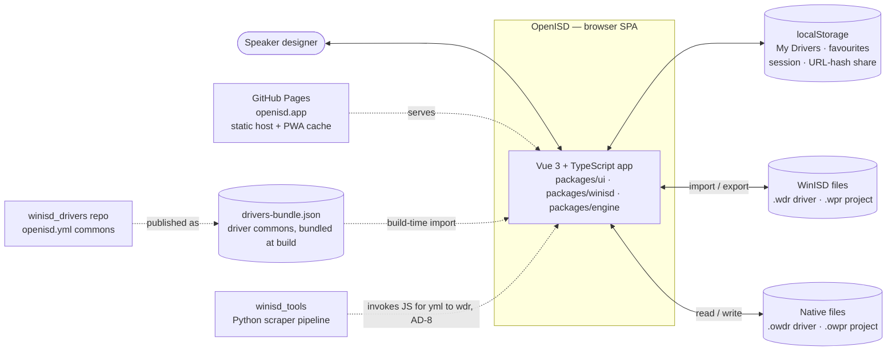
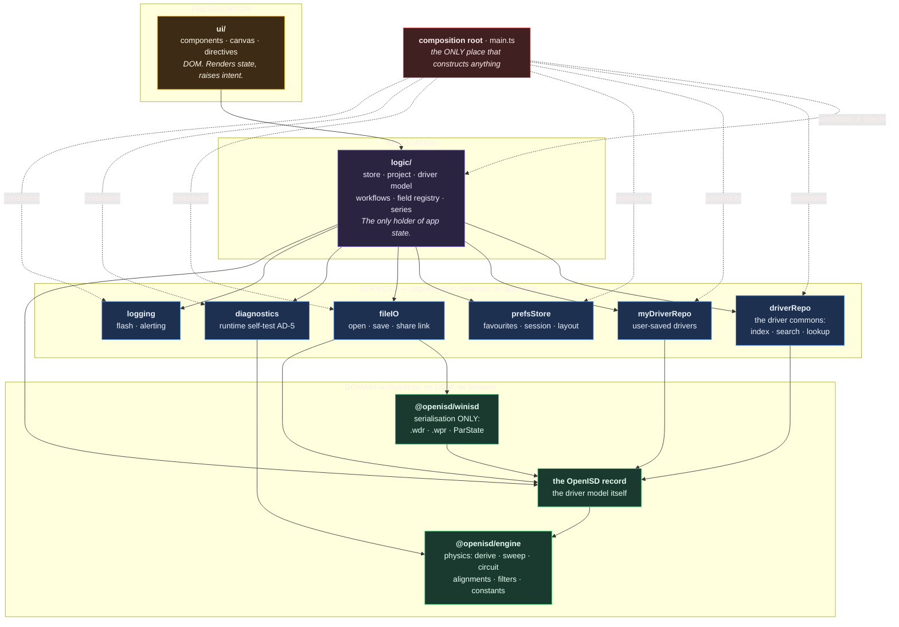

# OpenISD — architecture

**What this document is:** the system's structure and the hard, expensive-to-reverse decisions
that shape it — boundaries, components, dependency direction, and the data model. Each decision
carries its rationale, so a future contributor can tell a deliberate constraint from an accident.

**What this document is NOT.** Keep these out; they have owners:

| Not here | Owner |
| --- | --- |
| UI presentation rules, tooltips, panel layout, control conventions | [`docs/spec/SPEC_UI.md`](docs/spec/SPEC_UI.md) |
| Engine formulas, parameter units, API shapes | [`docs/spec/SPEC_ENGINE.md`](docs/spec/SPEC_ENGINE.md) |
| What the app remembers and when a change commits | [`docs/design/STATE_MODEL.md`](docs/design/STATE_MODEL.md) |
| Work items, gaps, "not yet implemented" | [`BACKLOG.md`](BACKLOG.md), [`docs/plans/`](docs/plans/) |
| What changed and when | [`LOG.md`](LOG.md), git |
| Dev workflow, ports, testing strategy | [`AGENTS.md`](AGENTS.md), [`openspec/project.md`](openspec/project.md) |

Decision IDs (`AD-n`, `UI-n`) are **stable identifiers** cited from source comments and tests.
Never renumber one; supersede it in place and keep the anchor.

---

## 1. System context

OpenISD is a single-page browser application with no backend (AD-1). Everything below the
dashed boundary runs in the user's browser; everything outside it is a file, a repo, or a
static host.



**Boundary consequences.** No server means no auth stack, no per-user storage, and no
server-side computation — the physics runs client-side or not at all (AD-1). The driver commons
is a **build-time artifact**, not a live API: a driver added to `winisd_drivers` reaches users on
the next deploy.

---

## 2. Component architecture

**Four layers. Every import points DOWNWARD, one layer at a time.** No upward import, no lateral
import between siblings, and no skipping a layer — the UI does not reach past `logic` into a
service, and a service does not reach back into the app's state.

Each box is ONE responsibility. A module that both fetches data and drives the UI has two, and
belongs in two places.



**Solid arrow = "is given, and calls". Dotted = "constructs".** Only the composition root
constructs. Every other arrow is a collaborator that arrived as an argument, so the thing at the
tail can be exercised in a test with a substitute at the head.

### Modules, purpose, and injected dependencies

**No module-level singletons, and no exported mutable bindings.** Each module exports a
`create<Name>(deps)` factory and nothing pre-built: a ready-made instance cannot be substituted, so
every consumer of one becomes untestable in isolation. `state` is created by the store factory and
handed to whoever needs it — it is not importable.

| Module | Single responsibility | Injected dependencies |
| --- | --- | --- |
| `main.ts` — composition root | Construct every service and the store, wire them, mount the app | — (it is the top; nothing injects into it) |
| `createStore` | Hold the application's state and nothing else | `driverRepo`, `myDriverRepo`, `prefsStore`, `fileIO`, `logging` |
| `logic/` workflows | Decide what the app does next — driver chosen, project opened, what-if applied | the store, plus whichever services that workflow needs |
| `createDriverRepo` | Answer questions about the driver commons: index, search, filter, lookup | a bundle source (`() => DriverRecord[]`) |
| `createMyDriverRepo` | Read, write and delete user-saved drivers by identity | a `KeyValueStore` |
| `createPrefsStore` | Browser-local preferences: favourites, session, layout | a `KeyValueStore` |
| `createFileIO` | Open, save, import, export, share-link encode and decode | the serialiser (`@openisd/winisd`), the record codec |
| `createDiagnostics` | Run the self-test and report what it found | the engine, a reporter (`(msg) => void`) |
| `createLogging` | Surface application events to the user | — (leaf; it depends on nothing) |
| `ui/` | Render state, raise intent | the app facade, via Vue `provide`/`inject` at the root |

A `KeyValueStore` is an interface — `get`/`set`/`remove`. `localStorage` is one implementation and
an in-memory map is another, which is what lets the repositories be tested without a browser.

**Why a repository, not a "db".** `driverRepo` and `myDriverRepo` answer questions about drivers
and hand back records. They take arguments and return data. They do not know a dialog is open,
they do not decide what happens next, and they never touch the store — a service that reads app
state has inverted the arrow and dragged the layer above it into its own.

**Where workflow lives.** "The user chose a driver" is a decision about what the app does next: it
belongs in `logic`, which may call a repository to fetch the record and then update its own state.
Putting that sequence inside a repository is what forces a service to import the store.

**Serialisation is a leaf.** `@openisd/winisd` turns the OpenISD record into WinISD's bytes and
back. WinISD is a consumer of our files and the reference oracle for our numbers — it is not our
model, so nothing above the domain layer knows what ParState is.

### Module responsibilities

| Module | Path | Owns | May not contain |
| --- | --- | --- | --- |
| `@openisd/engine` | `packages/engine/src/` | All electro-acoustic maths — driver derivation, circuit solve, sweeps, alignments, filters, physical constants | WinISD concepts (WDR, ParState), file formats, DOM |
| `@openisd/model` | `packages/model/src/` | The OpenISD record and `OpenISDDriver`: the driver model itself, its provenance, its derivation | File formats, DOM, app state |
| `@openisd/winisd` | `packages/winisd/src/` | Serialisation to and from WinISD's files: `.wdr`, `.wpr`, ParState, the carried-key set | The driver model, DOM, app state |
| `logic` | `packages/ui/src/logic/` | The app's ONLY state. Store, project/workspace model, workflows, field registry, chart-series mapping | Maths, `.vue` imports, direct construction of a service |
| `driverRepo` | `packages/ui/src/services/` | The driver commons: index, search, filter, lookup. Answers questions, returns records | App state, workflow, `.vue` imports |
| `myDriverRepo` | `packages/ui/src/services/` | User-saved drivers: read, write, delete by identity | App state, workflow, `.vue` imports |
| `prefsStore` | `packages/ui/src/services/` | Browser-local preferences — favourites, session, layout | App state, workflow, `.vue` imports |
| `fileIO` | `packages/ui/src/services/` | Open, save, import, export, share-link encode/decode | App state, workflow, `.vue` imports |
| `diagnostics` | `packages/ui/src/services/` | Runtime self-test, solver troubleshooting, diagnostic assertions | App state |
| `logging` | `packages/ui/src/services/` | Application event/alert surface (flash messages) | Any other module — it is a leaf |
| `ui` | `packages/ui/src/ui/` | Vue components, canvas drawing, directives, static presets | Physics, app state, anything a service owns |

### Dependency rules, and what enforces them

| Rule | Enforced by |
| --- | --- |
| `@engine` depends on nothing (zero runtime dependencies) | `packages/engine/package.json` — empty `dependencies` |
| `@openisd/winisd` depends only on `@engine` (+ `yaml`) | `packages/winisd/package.json` |
Every rule below is enforced by
[`packages/ui/test/ui/architecture.test.ts`](packages/ui/test/ui/architecture.test.ts) unless the
row says otherwise. It matches the SHAPE of the code — the import specifier, the exported
declaration — never prose, so a comment naming a module cannot fail it.

| Rule | Enforced by |
| --- | --- |
| `@engine` depends on nothing (zero runtime dependencies) | `packages/engine/package.json` — empty `dependencies` |
| `@openisd/winisd` depends only on `@engine` (+ `yaml`) | `packages/winisd/package.json` |
| Nothing below presentation imports a `.vue` file | the gate |
| `ui` imports `logic` and nothing below it — no service, no engine, no serialiser | the gate |
| A component imports no VALUE from `@openisd/*`; a `import type` is fine, it erases | the gate |
| A service never imports `logic`, and never imports a sibling service | the gate |
| No service exports a pre-built instance or a mutable binding | the gate |
| Every service module offers one `create<Name>(deps)` factory | the gate |
| No maths in `ui` / `logic` | `openspec/project.md` §"Important Constraints" — convention |

**A component may not call the engine.** The formula stays in `@engine`, but a component that
calls it has put a physics call in the view: the maths cannot then be changed without editing
components, and a second front-end has to re-wire those calls rather than only re-skinning. The
value a component needs is computed in `logic` and handed down as data.

---

## 3. Runtime data flow

One pass, driven by any parameter change. Nothing caches a curve; a sweep is cheap enough to
re-run on every edit.

```mermaid
sequenceDiagram
    actor User
    participant UI as @ui component
    participant Store as @logic store
    participant Driver as Driver ADT<br/>@openisd/winisd
    participant Engine as @engine
    participant Canvas as @ui canvas

    User->>UI: edits a T/S field / box volume
    UI->>Store: enterDriverField(field, value)
    Store->>Driver: enter(field, value)
    Note over Driver: marks field Entered (E);<br/>C/N derived, never set directly
    Driver->>Engine: deriveDriver(raw)
    Engine-->>Driver: Result{value, errors} — never throws
    Driver-->>Store: notify subscribers
    Store->>Engine: sweep(driver, boxType, params)
    Engine-->>Store: SweepResult — spl, phase, exc, zmag, tfMag, …
    Store->>Store: series.ts maps arrays to renderer Series[]
    Store-->>Canvas: reactive Series[]
    Canvas-->>User: redrawn charts + StatBar readouts
```

**Two invariants visible in that flow.** Failure travels as `Result{value, errors}` and nothing
in the engine throws (`.claude/rules/openisd-result-contract.md`). And `series.ts` is a
presentation adapter only — it does no acoustic maths and no baseline subtraction
(`docs/spec/SPEC_UI.md` §1.1).

**File I/O sits beside this loop, not inside it:** import populates the `Driver` ADT via
`Driver.fromWdr` / the native reader; export projects the live model back out (`toWdr()`). The
sweep never touches a file.

---

## 4. Decision record

### AD-1: Client-side only — no backend

**Decision:** The simulator runs entirely in the browser for as long as that remains feasible.
No server, no account, no API call is required for the physics engine or file operations.

**Rationale:**

- A backend costs money to run, adds availability risk, and creates natural pressure toward
  paywalling. The project's purpose is an unconditionally free, community-owned tool.
- The Thiele/Small model is pure mathematics — it needs no server.
- Removing the backend removes an entire class of infrastructure maintenance from the
  contributor burden.

**Consequence — backend implies an auth stack.** The moment any backend exists, authn/authz is
required, which means an IDP and session management. Preferred IDP if it is ever needed: Google.

**Implication:** A feature that *requires* a backend (accounts, cloud storage, collaborative
editing) is a deliberate architectural change, not a default direction. Cloud features that are
desirable anyway (e.g. Google Drive) are strictly opt-in and degrade gracefully.

**Status:** Adopted.

---

### AD-2: Offline support via PWA, not `file://`

**Decision:** Offline use is delivered by a Workbox service worker (Vite PWA plugin) that caches
the built app. The pre-Vite `file://` double-click constraint no longer applies.

**Rationale:** The build produces standard ES modules, which require a server origin and cannot
load from `file://`. A service worker delivers the same "works without internet" guarantee with
a better experience — installable, auto-updating.

**Status:** Adopted, superseding the `file://` constraint.

---

### AD-3: Concern-boundary separation — the core has no DOM

**Decision:** Code is split by concern, not merely "core vs UI". The physics and file-format core
contains no DOM, no `window`, no `document`, no canvas. Within the UI package, code is further
split into the five modules of §2, so state, data access, diagnostics and alerting are each
independently testable and never leak into presentation.

**Rationale:**

- The core is the reusable product. Another front-end — mobile, CLI, third-party — must be able
  to build on it without inheriting browser coupling.
- DOM-free code is directly testable in Node, with no stubs and no jsdom.
- The boundary makes the data contract explicit: the core takes data in and returns data out.
  That contract is [`docs/spec/SPEC_ENGINE.md`](docs/spec/SPEC_ENGINE.md) and
  [`docs/spec/SPEC_UI.md`](docs/spec/SPEC_UI.md).

**Status:** Adopted. Components, dependency edges and enforcement: §2.

---

### AD-4: Extract, do not rewrite

**Decision:** Re-architecture moves existing, validated engine code behind clean module
boundaries. It does not rewrite the physics from scratch.

**Rationale:** The engine is validated to < 0.03 dB against closed-form Thiele/Small physics.
That correctness was paid for. A clean-room rewrite discards it and re-introduces the same class
of bugs. Extraction is behaviour-preserving and verifiable by golden-master tests; a rewrite is
neither.

**Status:** Adopted. Binds any future migration, including AD-8's — `Driver`'s derivation
*algorithms* move onto `OpenISDDriver` rather than being re-derived.

---

### AD-5: Runtime self-test — bundle verification, distinct from build-time tests

**Decision:** A physics smoke-test (`packages/ui/src/diagnostics/selftest.ts`) runs once per page
load, in the user's browser, against the live deployed bundle. Results go to the console under
`[OpenISD self-test]`.

**Why it exists alongside the Node suite.** `npm run test:unit` proves the **source** is correct,
in Node, on a developer's machine. The self-test proves the **deployed bundle** is correct, in
the environment the user actually has. They catch different failures:

| Failure mode | Build tests | Self-test |
| --- | --- | --- |
| Logic bug in source | ✓ | ✓ |
| Bundler/minifier corrupts code | ✗ | ✓ |
| Tree-shaking drops a needed export | ✗ | ✓ |
| Browser JS engine edge case | ✗ | ✓ |
| Wrong constants after a config change | ✗ | ✓ |

**What it checks:** three physics gates — sealed-box SPL against the closed-form transfer
function (< 0.1 dB), passband sensitivity against the T/S radiation-efficiency formula
(< 0.5 dB), and a vented box rolling off at ~24 dB/oct with two impedance peaks straddling Fb.

**`window._selfTestDone`** is set on completion. Playwright waits on it before running
browser tests — a synchronisation signal, not a result.

**Status:** Adopted.

---

### AD-7: Shared behaviour lives in a composable, never duplicated per skin

**Decision:** OpenISD ships three interchangeable skins (`classic`, `original`, `modern` —
`packages/ui/src/ui/skins.ts`) over one store and one engine. Any behaviour beyond pure
presentation — a commit boundary, a derivation, a load/save flow — is written **once**, in a
composable under `packages/ui/src/logic/`, and every skin calls it. A skin that re-implements
logic another skin already has is a defect, not a variation.

**Rationale:** Three skins over one composable is one chance to get a commit boundary
(`docs/design/STATE_MODEL.md` rules 2–3) or a derivation right. Three private copies is three
chances to get it wrong, and a fix to one silently leaves two stale — precisely the divergence
the state model's dialog rules exist to prevent.

**Existing instances, not a hypothetical:** `useDriverSelection.ts` (draft → commit, all three
skins' editors), `useVentGroup.ts` / `usePrGroup.ts` (vent and PR entered-set solvers),
`useDesignIO.ts` (save/export, every skin's toolbar).

**Status:** Adopted, by convention. No automated gate checks a skin file for duplicated logic.

> Only the Original skin is maintained — see `AGENTS.md`. Classic and Modern remain in the tree
> as salvage sources and are not parity targets.

---

### AD-8: The driver model — `OpenISDDriver` is the app, `WinISDDriver` is a serialiser

**Decision (human, 2026-07-31):** The application is built around `OpenISDProject` and
`OpenISDDriver`. `OpenISDDriver`'s on-disk form is `openisd.yml` — the same schema, byte for
byte; `.owdr` is the extension the browser app uses for identical content when reading or writing
a single driver to local disk. There is one parse, not two, whether the source is a library
`openisd.yml` or a user's `.owdr`.

**`OpenISDDriver` owns the app.** It is the live, long-held in-memory model — every T/S field,
every derived value, all E/C/N provenance, all consistency-group derivation (Fs from Mms+Cms,
Cms from Fs+Vas+Sd, and the rest of that family, verified against real WinISD behaviour). It is
strongly typed against the real `openisd.yml` shape, confirmed against `winisd_tools`'
`model_driver.py` and `model_openisd.py` — **not one uniform envelope, but four, by field kind:**

| Envelope | Applies to | Shape |
| --- | --- | --- |
| `SpecEntry` | T/S fields, inside `specs:` only | **No flat value.** `origin` names the winning source; a required `readings` dict (≥ 1 source) carries each source's `{actual_reading, read_value, read_precision}`. The number is reachable only at `readings[origin].read_value`. |
| `ScrapedField<T>` | record-level metadata — `manufacturer`, `brand`, `model` | Flat `value: T`, plus `origin`, *optional* `readings` (populated only when ≥ 2 sources disagreed), `definition`, `dq` |
| `DerivedField<T>` | pipeline-computed — `sku`, `name` | `value: T` + `definition` + `grounds` (evidence list). No `origin`/`readings` — built, not read |
| `BookkeepingField<T>` | pure pipeline fact — `uuid` | `value: T` + `definition` |

**`WinISDDriver` is solely a serialisation device** — a strongly-typed, validating class, but
architecturally carrying no app or calculation logic at all. It does not derive, hold live state,
or persist between calls.

- **Export:** `OpenISDDriver`'s resolved values populate a `WinISDDriver` instance immediately
  before serialisation to `.wdr` text, then it is discarded.
- **Import:** `.wdr` text populates a `WinISDDriver`; those as-read values are diffed against
  what `OpenISDDriver` independently derives, surfacing a mismatch (e.g. a value hand-edited in
  classic WinISD) as a data-quality signal rather than silently overwriting.
- `.wdr` is therefore 100 % derivable from `OpenISDDriver` — generated on demand, never stored.
  Same relationship upstream: `openisd.yml` is 100 % derivable from `driver.yml`.

**Today's `Driver` class dies.** Checked, not assumed: its storage
(`#inputs: Record<string, number|string>`) is flat — the same shape as a parsed `.wdr` — and none
of `openisd.yml`'s per-field (`origin`/`read_precision`/`definition`) or record-level
(`quality`/`disposition`/`data_sources`) structure exists in it anywhere. It is WinISD's data
model wearing a neutral name, not `openisd.yml`'s. Under AD-4 its validated derivation
*algorithms* move onto `OpenISDDriver`, where live edits happen and "recompute the rest" has to
live; but the class itself, as a long-lived object the app instantiates and holds, has no
remaining architectural role. `WinISDDriver` does not inherit its derivation machinery — under
AD-9 it carries none.

**`DriverRaw` is retired (AD-9).** The calc layer still needs flat numeric input to do arithmetic
on, so a narrow successor type is needed at that boundary — scoped to exactly what `deriveDriver`
and `sweep` read, typed under AD-9, not a rename of `DriverRaw`'s shape.

**`openisd.yml` is read and written EXCLUSIVELY by JS/TS owned by OpenISD — never by Python**
(human, 2026-07-31). When `winisd_tools` needs an `openisd.yml` from a `driver.yml`, it invokes
the JS/TS code with the input and output paths rather than writing one in Python. One
implementation of each transform, not one per language. Same pattern in the yml→wdr direction.

**Lifecycle of `origin` for a live edit** (human, 2026-07-31, resolved):

- A field's `origin` stays whatever it was extracted as (`manufacturer_datasheet`, …) until the
  human overwrites it in the UI, at which point it becomes `SourceRole.MANUAL`.
- Reset reloads the prior snapshot, restoring the `origin` it held before the edit — this is what
  the existing ground/baseline layering (`docs/design/STATE_MODEL.md`) already does. No new
  mechanism.
- A normally-*calculated* field that is manually entered MUST be written to the `.owdr` with
  `origin: manual` — it is now an asserted fact, not something to silently re-derive. Clearing it
  reverts it to calculated and **removes it from storage again**, the same enter/clear pattern
  already in `useVentGroup.ts`/`usePrGroup.ts` and today's `Driver.enter()`/`.clear()`.

**Scope: the driver record only.** Box/vent/PR/filter/signal/UI-navigation state has no fields in
`openisd.yml` and none are added — that stays `OpenISDProject`'s (`.owpr`'s) concern. The
multi-layer state model is multiple *copies* of the one `OpenISDDriver` shape, not different
shapes of it.

**Status:** Adopted, not implemented. Execution plan, remaining gaps and open mechanical
questions: [`docs/plans/PLAN_OPENISD_DRIVER_MODEL.md`](docs/plans/PLAN_OPENISD_DRIVER_MODEL.md).

---

### AD-9: Strong typing over loose bags

**Decision (human, 2026-07-31):** No untyped grab-bag types — no all-optional interface accepting
fields a consumer never reads, no `Record<string, any>`, no shape whose real contract is narrower
than its declared type. Every type states exactly what it holds and why; every boundary that can
fail validates and reports rather than accepting anything and hoping. Governs AD-8 and applies
project-wide, not only to drivers.

**Evidence this is a defect, not a style preference:** `DriverRaw`
(`packages/engine/src/types.ts`) declares ~40 all-optional fields — full T/S numerics alongside
`brand`, `comment`, and four separate URL fields. `deriveDriver(d: DriverRaw)`
(`packages/engine/src/driver.ts:29`) takes the whole interface as its parameter type but reads
only a handful of numeric fields. The metadata fields duplicate — with no provenance — exactly
what `OpenISDDriver` models properly.

**Status:** Adopted. `DriverRaw` is retired under it; nothing inherits its shape unmodified.

---

## 5. Superseded decisions

Kept as anchors because source comments cite them. **Do not treat these as current guidance.**

### AD-6: Thin UI over a reusable core — separate WinISD interop from pure calc ⛔ SUPERSEDED

**Superseded by AD-3 (component structure) and AD-8 (the driver model).** Its layering intent
survives; its model does not. AD-6 put a `winisd` layer holding "the Driver model
(enter/clear/state)" directly beneath the UI — treating WinISD's data model as the app's core.
AD-8 reverses exactly that: `OpenISDDriver` is the app's model and `WinISDDriver` is a
serialisation device with no live state. AD-6's four-layer names (`calc`, `winisd`, `winisd-ui`,
`UI`) never existed as directories; the real modules are §2's.

**What still holds, and is stated in AD-3/§2 instead:** dependencies point one way only, the
physics core stays WinISD-free and DOM-free, and file-format concerns live above the engine, not
inside it.
