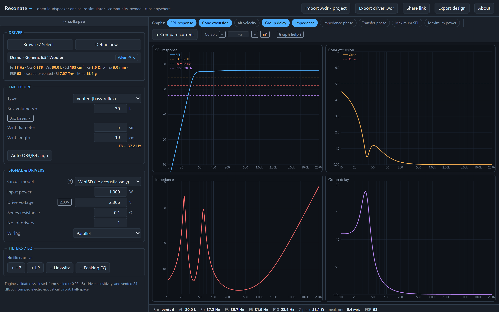
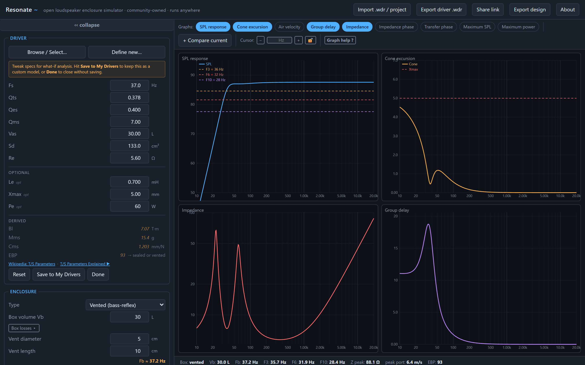
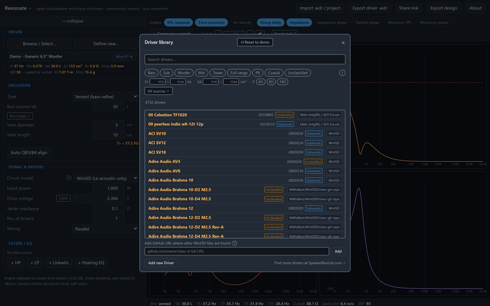
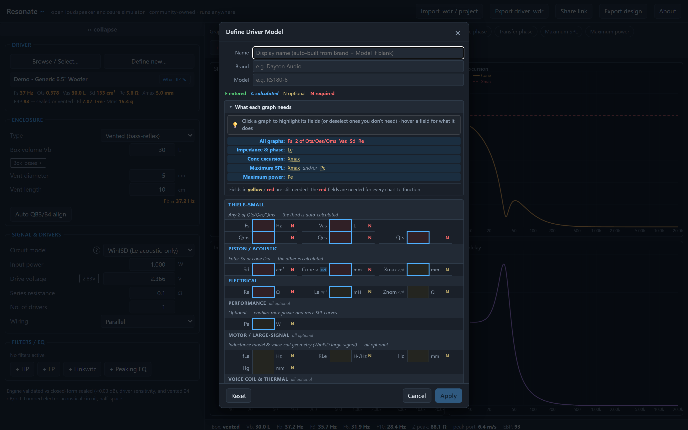

# Resonate

**An open, community-owned loudspeaker enclosure simulator that runs in any browser.**

_Speaker design belongs to everyone who builds._

Resonate is a modern, free, open-source replacement for WinISD — a tool to design
sealed, vented, bandpass, and passive-radiator enclosures from a driver's
Thiele/Small parameters. No install, no licence key, runs in any browser.
Validated against the closed-form physics, with a self-test that proves it
on every load.

It started as a quick spike, and it has come a long way since. The physics engine (`src/core/`) is now clean and modular, with a full unit, golden, and browser test suite checked against the exact closed-form solutions. Two rough spots from the prototype days remain, and both are tracked in the open: some duplicated structure on the data-scraper side, and the engine's input-validation boundary — incomplete input can still produce a `NaN` instead of a clear error. [HOW_NOT_TO_BE_SHITTY_VIBE_CODED.md](HOW_NOT_TO_BE_SHITTY_VIBE_CODED.md) lists each problem, the fix, how the fix is enforced, and — honestly — where Resonate stands on it today. The plan for turning those fixes into checks the build runs automatically is in [PLAN.md](PLAN.md) and [SDLC.md](SDLC.md).

WinISD has been abandoned and is closed source, so there is no way to move it forward. Resonate exists to build a modern, open alternative — compatible with WinISD's file formats (and others), and answering the many complaints about the old tool. The long-term goal is something that doesn't rot when I drop dead or lose interest — a tool that stays trustworthy because the rules that keep it clean are enforced by the build, not by memory.

**I am looking for a band of the willing to move this thing forward.** Please volunteer your time with ideas, feedback, and pull requests.

## Who am I?

I am a software engineer with 40 years of experience and would like to do the right thing here and have a bit of fun at the same time.

My bio, CV and all my Hackaday projects can be found on my personal page https://johnlon.github.io/

But I need your help; that's the whole point!

> ## ▶ [**Launch Resonate**](https://johnlon.github.io/resonate/)
>
> Runs in your browser — nothing to install if you don't want to.
> Mobile layout is a known gap — contributions welcome.
>
> **To install for offline use (PWA):**
>
> - **Chrome / Edge / Android:** open the site, click the install icon in the address bar (or the ⋮ menu → "Install Resonate")
> - **iOS Safari:** tap the Share button → "Add to Home Screen"
>
> Once installed the app works without an internet connection.

_The main simulator._ Driver and enclosure controls sit on the left; the response
graphs fill the right. Everything is **live**: change the box volume, drag the vent
length, swap the driver or the box type, and every curve — SPL, cone excursion,
impedance, group delay — redraws on the same keystroke. There is no "calculate"
button and no waiting. That instant feedback is what makes exploring a design fast
and genuinely fun — you can feel how each parameter pushes the response around
instead of guessing.

---

## Why

The speaker-design tool landscape is a graveyard. WinISD has been abandoned since
2016 and is Windows-only. Basta, Unibox, the old spreadsheets — fragmented and
dead. The web calculators that filled the gap mostly can't be trusted at the
frequencies that matter.

The Thiele/Small math has been public since the 1970s. The knowledge is open; the
tools are not. Resonate exists to close that gap, and to do it **once, together**,
instead of as another solo project that dies in a year.

## What it does

- **Box types:** sealed, vented (bass-reflex), 4th-order bandpass, passive radiator
- **Curves:** SPL, driver + PR cone excursion, port air velocity, group delay,
  impedance magnitude & phase, transfer-function phase, max SPL, max power
- **Design aids:** EBP box-type gauge, Qtc / QB3-B4 alignment helpers, vent
  length ↔ tuning solver, passive-radiator Fp tuning + mass auto-tune,
  multiple drivers (series / parallel)
- **Files:** import **and** export WinISD `.wdr` driver files; save/load whole
  projects as JSON

_What-If editor._ Click any driver to open its Thiele/Small parameters (Fs, Qts,
Qes, Vas, Sd, Re, Le, Xmax, Pe) for inline editing. Nudge a value and the graphs
respond immediately — the same live loop as the box controls — so you can ask
"what if this driver had a lower Fs?" or "a bigger Vas?" and _see_ the answer at
once. Derived quantities (Bl, Mms, Cms, EBP) recompute as you type. It is a
scratchpad: nothing you try here changes the shared library entry until you
explicitly **Save to My Drivers**.

## Resonate vs WinISD

WinISD is the canonical reference tool. Resonate's default mode replicates its
simulation output. But Resonate goes further in several areas:

|                       | WinISD 0.7                                                | Resonate                                                         |
| --------------------- | --------------------------------------------------------- | ---------------------------------------------------------------- |
| **Platform**          | Windows-only desktop app                                  | Any browser, no install                                          |
| **Source**            | Closed, abandoned 2016                                    | Open source, MIT licence                                         |
| **Circuit model**     | Simplified acoustic-domain only (Le excluded from SPL/GD) | Both WinISD-compatible **and** full gyrator with Le (switchable) |
| **Box losses**        | Ql + Qa via hidden "Advanced→" popup                      | Ql + Qa with practical stuffing guide                            |
| **Cursor / readout**  | Mouse hover only                                          | Hover + right-click snap to peak/trough + lock + Hz input        |
| **Design compare**    | Not supported                                             | Pin any design, overlay curves                                   |
| **State persistence** | Manual project files                                      | Auto-saves to browser storage                                    |
| **Filter / EQ**       | Yes                                                       | Yes                                                              |
| **Passive radiator**  | WinISD-style inputs                                       | WinISD **and** T/S modes, switchable                             |

### Why the circuit model switch matters

WinISD computes SPL and group delay using a simplified acoustic-domain model where voice-coil
inductance (Le) does not affect the simulation — only the impedance plot. Resonate defaults to
this mode so cross-checks against WinISD are exact.

The **Full gyrator** mode includes Le throughout: the driver's electrical back-impedance becomes
frequency-dependent, which is physically correct and matters when Le is large (>1 mH) or when
accuracy above a few hundred Hz is needed. Group delay peak frequency shifts by ~2 Hz in the
demo driver (Le = 0.7 mH) — a real physical difference, not a bug in either tool.

Switch between modes in the **Signal & drivers** panel → Circuit model.

## Trust, not vibes

Every model is validated against the exact closed-form solutions:

- the sealed box reproduces `fc = Fs·√(1+Vas/Vb)`, `Qtc = Qts·√(1+Vas/Vb)` to
  **< 0.03 dB**
- the passband asymptotes to the driver's reference sensitivity
- the vented box rolls off at 24 dB/oct with two impedance peaks straddling Fb

The app runs these as a self-test in your browser console on load, and they run in
CI from `test/engine.test.mjs`. If the physics is wrong, the test goes red — in
public. See [CONTRIBUTING.md](CONTRIBUTING.md) for the model.

## Run it

- **Hosted:** <https://johnlon.github.io/resonate/> — nothing to install
- **PWA / offline:** see the install instructions in the callout above
- **Local dev:** `npm install && npm run dev` — opens at `http://localhost:5173`
- **Build:** `npm run build` — output goes to `dist/`, serve with any static host

## Driver library

`drivers/` holds community-contributed `.wdr` files. Got a driver Resonate
doesn't? Import its spec sheet, check the numbers, and open a PR with the `.wdr`.
Every spec sheet added is a gift to the next builder — this shared library is the
whole point.

_Driver library browser._ Search thousands of community-contributed drivers, or
narrow the list by type (sub, woofer, mid, tweeter, PR, coax…), by Fs, by Sd, by
nominal impedance, or by source. Pick one and it loads straight into the current
design, so the graphs redraw around the real driver you're considering — making it
easy to audition candidate drivers against the same box in seconds.

_Define Driver Model._ Enter a driver Resonate doesn't have yet, straight from its
datasheet. Fields are grouped (Thiele/Small, piston/acoustic, electrical,
motor/large-signal, voice coil/thermal) and the **"what each graph needs"** legend
at the top highlights exactly which values a given chart depends on — so you can
see what's required for the curves you care about and skip the rest. Enter two of
Qts/Qes/Qms and the third is calculated for you; the same goes for Sd ↔ cone
diameter. Once saved, the driver behaves like any other — drop it into a box and
the graphs update live.

## Contributing

Newcomers welcome — you do not need to be an acoustician. The physics engine lives
in `src/core/`; a new box type or filter is a weekend and a pull request. Start
with [CONTRIBUTING.md](CONTRIBUTING.md) and the [backlog](BACKLOG.md).

## Free?

Yes. The entire app runs in your browser — there is no backend, no server, no
account. The physics engine is client-side JavaScript; your designs never leave
your machine unless you choose to share them.

The intention is to keep it that way for as long as it's feasible. Any feature
that genuinely required a backend would be a large, explicit architectural
decision — not a default direction. The goal is that as much of the app's functionality remains free as long as
that's feasible. If a backend turns out to be necessary for something, that's
a decision for the community to make together. The source is MIT-licensed; if the maintainers vanish, fork it and
carry on.

## License

MIT — forever. See [LICENSE](LICENSE). Resonate can never be closed up, taken
away, or left behind a login. If the maintainers vanish, fork it and carry on.
