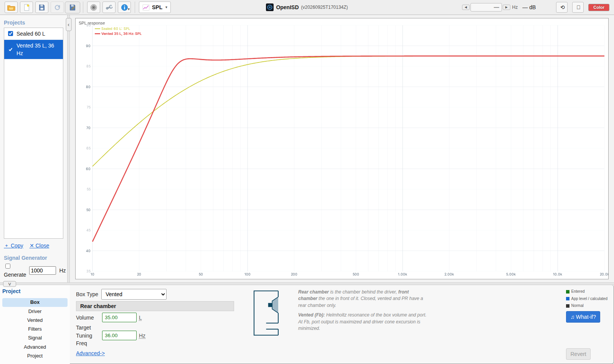
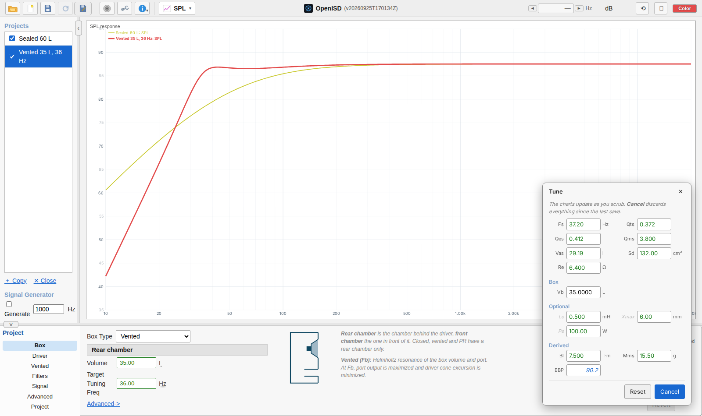
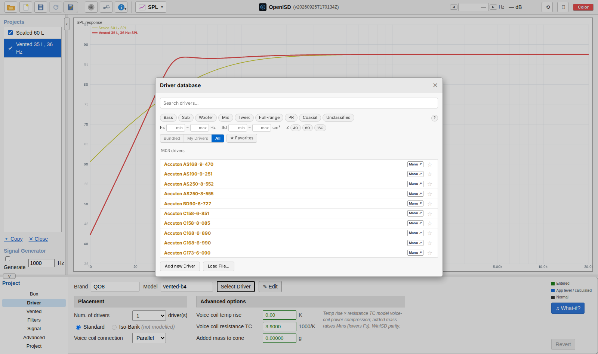

[](https://openisd.app/)

# OpenISD

**An open loudspeaker enclosure simulator that runs in any browser.**

OpenISD designs sealed, vented, bandpass and passive-radiator enclosures from a driver's
Thiele/Small parameters. It reads and writes WinISD's `.wdr` and `.wpr` files. By default it
reproduces WinISD's calculations, and it is checked against files WinISD itself saved.
It is free, open source and needs no install.

> ### ▶ [Launch OpenISD](https://openisd.app/)
>
> To install it for offline use:
>
> - **Chrome, Edge or Android:** use the install icon in the address bar.
> - **iOS Safari:** choose Share, then Add to Home Screen.



Every curve redraws as you type. There is no Calculate button.

## Features

- **Box types:**
  - sealed, vented, 4th-order bandpass and passive radiator;
  - several drivers, wired in series or parallel.
- **Charts:**
  - SPL and transfer function;
  - group delay;
  - cone excursion of the driver and the radiator;
  - impedance magnitude and phase;
  - port air velocity;
  - maximum SPL and maximum power;
  - the filter chain's response;
  - several designs overlaid for comparison.
- **Design tools:**
  - WinISD's sealed and vented alignments (QB3, BB4, EBS3, EBS6, C4);
  - vent length from tuning, and tuning from length;
  - radiator mass for a target tuning;
  - an EBP gauge.
- **Solvers that work in every direction.** Enter what you know and the rest is derived. For
  example, any two of Qts, Qes and Qms give the third.
- **Data-quality marks:**
  - each value shows whether it was entered or calculated;
  - when a driver's own figures contradict each other, the app says which ones.
- **What-if tuning.** Adjust a driver's parameters and the box, and watch the curves respond.
  Nothing is saved; cancel and the design is exactly as it was.
- **Driver library.** 1,603 drivers and 79 passive radiators come bundled, with source links,
  alongside your own saved drivers.
- **Air per project.** Each project has its own temperature, humidity and pressure, which set
  the speed of sound and the air density. WinISD's air model is the default.
- **Files and sharing:**
  - WinISD `.wdr` and `.wpr`, and OpenISD's own `.owpr` and `.owdr`;
  - share a design as a link;
  - open projects are saved automatically in the browser.





## OpenISD and WinISD

WinISD, by Linearteam, is the tool this project grew from. It stopped at version 0.7, runs
only on Windows, and its source was never released. OpenISD carries the idea forward.

- **Goal:** by default, OpenISD behaves 100% like WinISD, warts and calculation bugs included
  (not crashes, hangs or data loss). Every
  control the two share does what it does in WinISD.
- **Stretch goal:** for interest and education, offer other conventions, such as the textbook
  models, where WinISD departs from them. Each one sits behind its own switch or drop-down in
  the WinISD Compatibility panel. Left untouched, those switches give WinISD's answer.

- **Compatible:**
  - it opens and writes WinISD's files;
  - by default its numbers match WinISD's.
- **Different on purpose:**
  - contradictory inputs are marked, not silently discarded;
  - a typed value is never rewritten behind the user's back;
  - each project keeps its own air conditions.
- **Not there yet:**
  - 6th-order bandpass, ABC and isobaric loading;
  - amplifier load, port gain and radiator transfer function charts;
  - all-pass, delay and static-gain filters.

Details:

- [ARCHITECTURE.md §9–10](ARCHITECTURE.md#9-deliberate-departures-from-winisd): the departures and a feature-by-feature comparison.
- [Gap list](OPENISD_WINISD_GAPS_AND_BUGS.md): calculation differences still open.

## Run it locally

```bash
npm install
npm run dev        # development server
npm run build      # production build in packages/ui/dist/
npm test           # the full test gate
```

## Documentation

| Document                                           | What it covers                                                        |
|----------------------------------------------------|-----------------------------------------------------------------------|
| [ARCHITECTURE.md](ARCHITECTURE.md)                 | Layers, domain model, solving, state, formats, testing, WinISD comparison |
| [RESEARCH.md](RESEARCH.md)                         | The theory, what WinISD is built on, and WinISD's measured behaviour  |
| [OPENISD_WINISD_GAPS_AND_BUGS.md](OPENISD_WINISD_GAPS_AND_BUGS.md) | Open differences from WinISD                             |
| [FEATURES.md](FEATURES.md) · [BACKLOG.md](BACKLOG.md) | Features and planned work                                          |
| [BUGS.md](BUGS.md)                                 | Known open bugs                                                       |
| [TESTING_STRATEGY.md](TESTING_STRATEGY.md)         | How the app is tested                                                 |
| [CONTRIBUTING.md](CONTRIBUTING.md)                 | How to contribute                                                     |
| [DOCUMENTATION.md](DOCUMENTATION.md)               | Index of every other document                                         |

## Get involved

Contributions are welcome. Start with [CONTRIBUTING.md](CONTRIBUTING.md) and the
[backlog](BACKLOG.md).

Maintainer: [John Lonergan](https://johnlon.github.io/).

## Licence

MIT. See [LICENSE](LICENSE).
