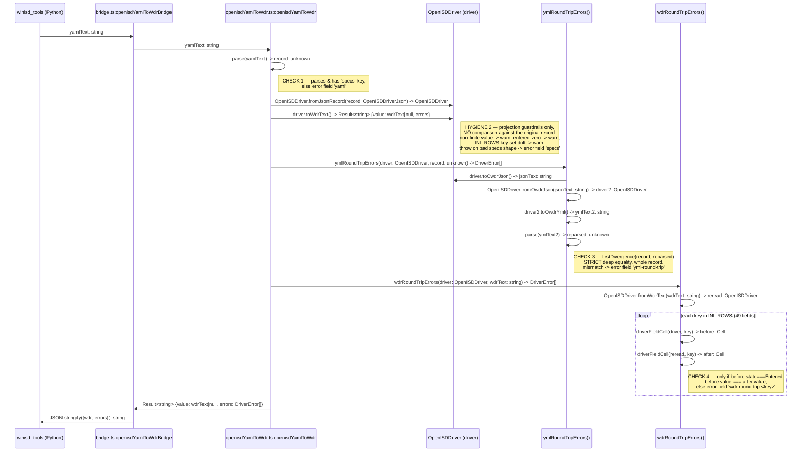

# `openisdYamlToWdr` — sequence and embedded validation

The one V8-bridge production call (`packages/winisd/src/bridge.ts:globalThis.openisdYamlToWdr`).
`winisd_tools` makes exactly this one call per record; every check below runs inside it.

## What actually compares a value against the original record — only 2 of the 4 items

| # | Kind | Check | Compares against original? | Scope | Fires as |
|---|---|---|---|---|---|
| 1 | structural | YAML parses, record has `specs` | no — shape only | whole input | `error / yaml` |
| 2 | hygiene | non-finite value, entered-zero, INI_ROWS key-set drift | **no** — projection guardrail only | per field | `warn / <field>` (or `error / specs` if construction throws) |
| 3 | **value comparison** | yml→json→yml round trip, strict deep-equal | **yes** — every field, whole record | whole record | `error / yml-round-trip` |
| 4 | **value comparison** | yml→wdr→yml round trip, numeric equality | **yes** — `Provenance.Entered` fields only | 49 `INI_ROWS` fields | `error / wdr-round-trip:<field>` |

Item 2 is easy to mistake for validation because it lives next to the two real checks and also
reports through the same `errors` array — but it never reads the original record a second time.
It cannot catch a value silently changing during projection (e.g. a unit-conversion bug that
still produces a finite, non-zero number). Only checks 3 and 4 would catch that, and only for
the fields they cover: 3 covers the whole record via the JSON/YAML twin (lossless format, so no
gap); 4 covers only `INI_ROWS`-tracked, originally-`Entered` fields, because `.wdr` cannot carry
the rest (`uuid`, `quality`, provenance, `data_sources`, non-`INI_ROWS` spec fields) — a bug
confined to one of those un-covered fields would not be caught by either round trip.

Check 4 only runs if check 2 produced a non-null `wdrText`. All four items are inside
`openisdYamlToWdr` — one Python call — but only 3 and 4 are round-trip validation.

Source: `packages/model/src/openisdYamlToWdr.ts`, `packages/winisd/src/bridge.ts`.
