# WinISD Box Types

Screenshots of the box-type panels (as shown in the box editor) alongside the
corresponding box-shape icon, for each enclosure type.

## Sealed

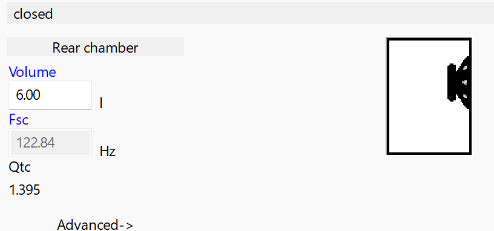

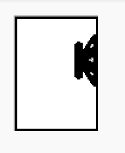

## Vented

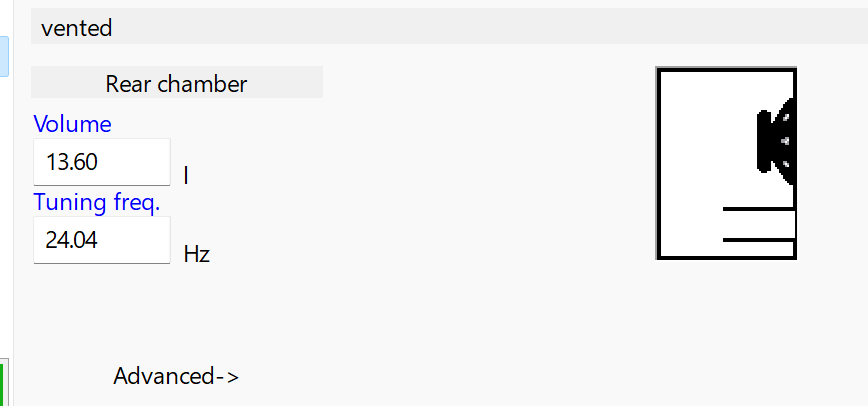

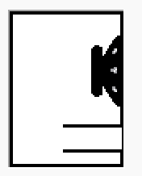

## Passive Radiator

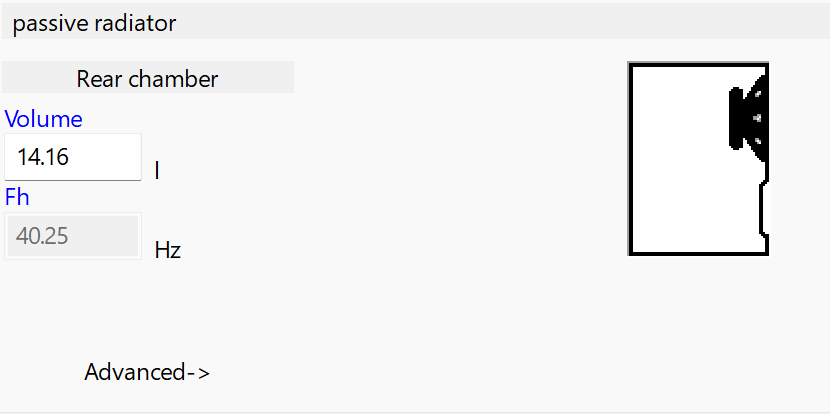

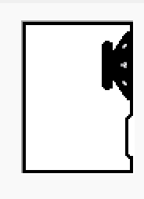

## 4th Order

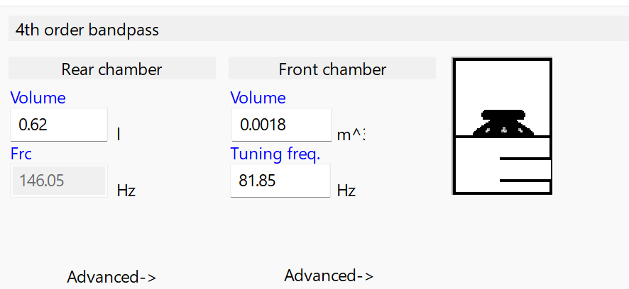

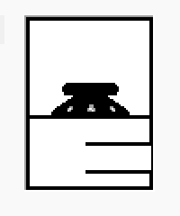

## 6th Order

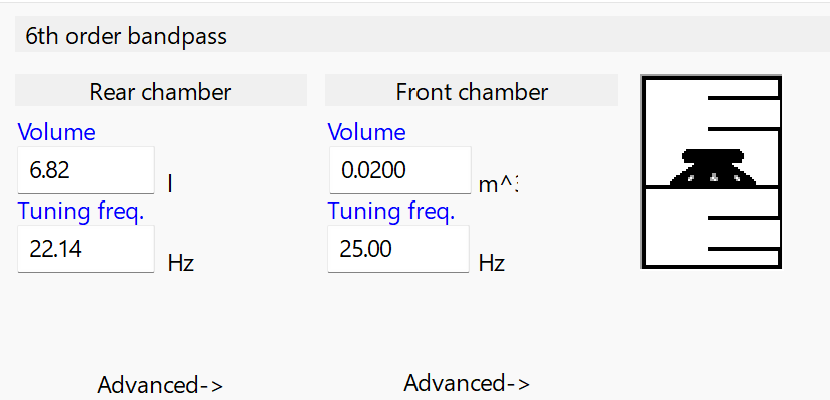

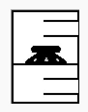

## ABC / Aperiodic Bi-Chamber

<https://dbdynamixaudio.com/dual-chambered-tri-tuned-bass-reflex-enclosure-calculator/>

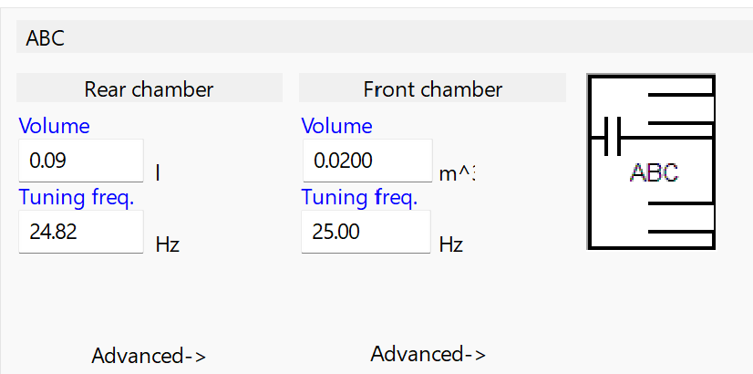

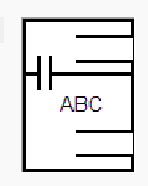

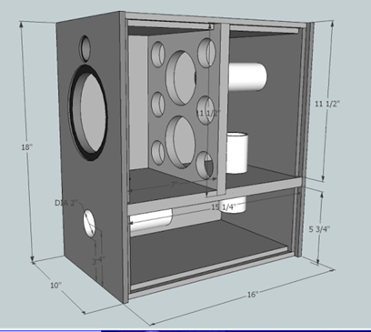

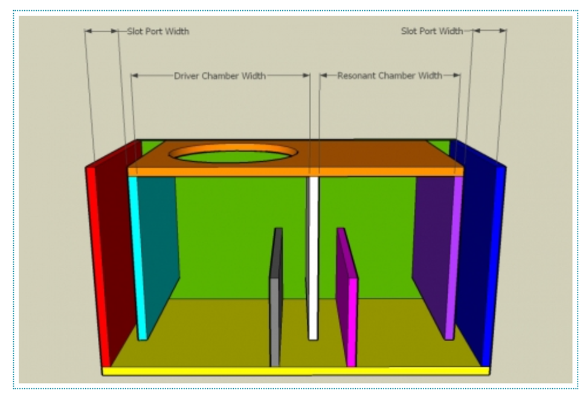
